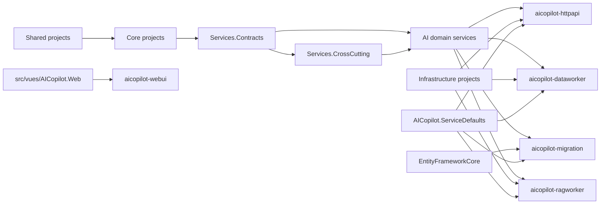

# AICopilot build granularity plan

本文只记录 AICopilot 镜像构建粒度的依赖事实和后续方案。本次不修改 `aicopilot-image.yml` 的路径映射，避免在没有完整验证前漏构建生产镜像。

## 当前构建口径

`aicopilot-image` 已经独立构建五个应用镜像：

- `httpapi`
- `migration`
- `dataworker`
- `ragworker`
- `web`

当前规则保守：宿主目录只构建对应镜像；`src/core/`、`src/shared/`、`src/services/`、`src/infrastructure/`、构建配置或手动触发会构建全部后端镜像。

## 真实项目引用

关键事实：

- `AICopilot.HttpApi` 引用 Infrastructure、AiGatewayService、DataAnalysisService、IdentityService、McpService、RagService、Contracts、CrossCutting、ServiceDefaults。
- `AICopilot.DataWorker` 引用 EF、Infrastructure、EventBus、AiGatewayService、DataAnalysisService、IdentityService、RagService、Contracts、ServiceDefaults。
- `AICopilot.RagWorker` 引用 Infrastructure、RagService、ServiceDefaults。
- `AICopilot.MigrationWorkApp` 引用 EF、IdentityService、Contracts、ServiceDefaults。
- `AICopilot.Infrastructure` 又引用 AiRuntime、Dapper、Embedding、EF、EventBus、AgentPlugin，因此 infrastructure 目录变更不能轻易只构建一个宿主。
- `src/vues/AICopilot.Web/` 只影响 `aicopilot-webui`。

## 后续可选收窄方案

只有在单独确认后才改 workflow。建议映射如下：

| 变更路径 | 建议构建 |
| --- | --- |
| `src/hosts/AICopilot.HttpApi/**` | `httpapi` |
| `src/hosts/AICopilot.MigrationWorkApp/**` | `migration` |
| `src/hosts/AICopilot.DataWorker/**` | `dataworker` |
| `src/hosts/AICopilot.RagWorker/**` | `ragworker` |
| `src/hosts/AICopilot.ServiceDefaults/**` | `httpapi,migration,dataworker,ragworker` |
| `src/services/AICopilot.McpService/**` | `httpapi` |
| `src/services/AICopilot.AiGatewayService/**`、`src/services/AICopilot.DataAnalysisService/**` | `httpapi,dataworker` |
| `src/services/AICopilot.RagService/**` | `httpapi,dataworker,ragworker` |
| `src/services/AICopilot.IdentityService/**` | `httpapi,dataworker,migration` |
| `src/services/AICopilot.Services.Contracts/**`、`src/services/AICopilot.Services.CrossCutting/**` | `httpapi,migration,dataworker,ragworker` |
| `src/infrastructure/AICopilot.EntityFrameworkCore/**` | `httpapi,migration,dataworker,ragworker` |
| `src/infrastructure/AICopilot.Dapper/**`、`src/infrastructure/AICopilot.Embedding/**`、`src/infrastructure/AICopilot.AiRuntime/**`、`src/infrastructure/AICopilot.EventBus/**`、`src/infrastructure/AICopilot.Infrastructure/**` | `httpapi,dataworker,ragworker` |
| `src/core/**`、`src/shared/**` | 先保持 `httpapi,migration,dataworker,ragworker`，除非进一步拆出稳定边界 |
| `src/vues/AICopilot.Web/**` | `web` |

## 执行前必须验证

1. 用 `dotnet build` 分别验证 `AICopilot.HttpApi`、`AICopilot.MigrationWorkApp`、`AICopilot.DataWorker`、`AICopilot.RagWorker`。
2. 对每个收窄映射做一次模拟 changed-files 输入，确认不会漏掉依赖宿主。
3. 只在确认后修改 `aicopilot-image.yml`，并保留 `workflow_dispatch` 全量构建入口。
