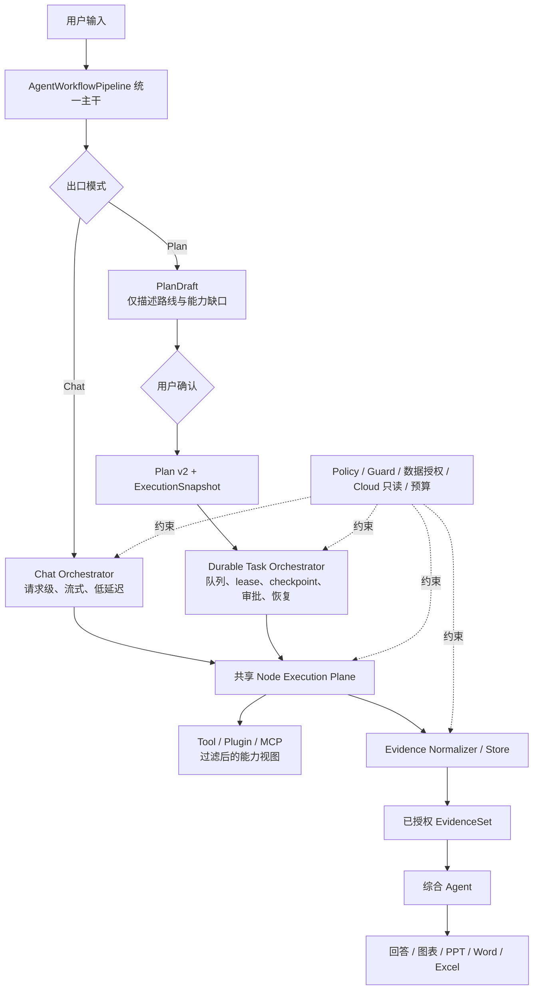

# AICopilot 后续 AI 架构升级总计划

> 状态：最终实施总计划 v2.2，已吸收两轮独立评审并完成关键架构裁决
>
> 日期：2026-07-17
>
> 适用项目：`AICopilot`
>
> 研究对象：AICopilot 当前源码，以及固定提交的 OpenCode、Codex、Cline、Gemini CLI、Goose、Grok Build
>
> 核心方向：一套节点契约、两种生命周期编排；最小 PlanCompiler 前置；运行时地基先行；Skill 后置物理退役
>
> 非授权声明：本文不授权修改源码、数据库、Cloud、Edge、部署环境或生产数据

---

## 1. 文档定位

本文将前期讨论、AICopilot 源码核验、六个开源 Agent 框架源码核验、Kimi 两轮评审及补充复核意见，收敛成一份可拆批、可验收、可停止的最终实施总计划。

它回答五个问题：

1. AICopilot 最终应当成为怎样的平台。
2. Coding Agent 框架哪些原理与企业 AI 相通，哪些实现不能照搬。
3. 为什么 Skill 可以退役，以及为什么不能现在直接删除。
4. Chat 快速链和 AgentTask 长任务链如何统一，而不制造一个巨型运行时。
5. 从当前系统走到目标架构，应按什么顺序实施和验收。

### 1.1 当前仍然有效的正式契约

在具体阶段完成实施、测试并更新长期规则之前，当前正式约束仍以以下文档为准：

- `../AGENTS.md`
- `../资料/AICopilot业务规则.md`
- `Agent工作流与异常契约.md`
- `Cloud只读数据分析契约.md`
- `DDD聚合根边界.md`
- `AI架构治理清单.md`
- `../../docs/三项目测试架构治理总计划.md`

本文是未来实施总计划，不是当前生产执行入口，也不自动授权任何阶段开工。进入具体实施时：

1. 长期不变的结论进入项目规则或专题契约。
2. 获准实施的事项进入 `AI架构治理清单.md`，按编号、严重级、状态和验证门禁管理。
3. 本计划在有效内容迁移完成后归档或清理，不与正式契约长期并行。

### 1.2 本文不代表已经完成

本文不得被解释为：

- 已经删除 Skill。
- 已经实现 Plan v2。
- 已经统一 Chat 与 AgentTask 执行平面。
- 已经实现数据库耐久 DAG。
- 已经允许模型自主创建子 Agent。
- 已经允许 AICopilot 直接连接 PLC。
- 已经允许 AICopilot 写 Cloud 业务数据。
- 已经实现设备故障预测或剩余寿命预测。
- 已经授权修改 CloudPlatform 或 EdgeClient。
- 已经完成生产部署或线上验收。

### 1.3 结论分级

本文使用三种结论口径：

| 级别 | 含义 |
|---|---|
| 源码事实 | 已在固定提交或当前 AICopilot 源码中直接确认 |
| 工程推论 | 根据源码行为得出的架构影响，需在设计评审中确认 |
| 计划决策 | 本轮已经确认的目标方向，实施前仍需进入正式契约和治理清单 |

开源仓库固定提交只代表本次核验基线，不代表远端最新版本，也不代表其全部能力。

### 1.4 实施基线门（B0）

本计划冻结前读取到的 AICopilot `main` 为 `70de5d2d5727423545955bb6663e4189d03f189b`；工作区测试治理总计划登记的 AICopilot 完成基线为 `87b2336630125d6168b0b7efb5d4b4e8a97a2c60`。后者当前不在前者祖先链上，且当前 `main` 仍保留 `AICopilot.BackendTests` 等旧测试桶，因此不得把测试治理文档中的 25 项目、1011 required cases 和旧桶已删除直接当作本计划的现行源码事实。

B0 是 P0 之前的强制入口门：

1. 实施分支必须基于一个 clean HEAD，且该 HEAD 已包含 `87b233...` 的治理结果或在当前 `main` 上重新执行并形成等价的新基线。
2. 若选择合并或 rebase 测试治理分支，必须先解决与当前 `main` 的真实冲突，再重新生成 inventory、discovery、execution、Skip、Analyzer 和 workflow 证据；不得沿用旧计数猜测已完成。
3. 若不合入 `87b233...`，必须先把工作区测试治理总计划和 AICopilot 当前源码状态重新对账，形成唯一新基线；不得让两份互相冲突的“当前状态”并行存在。
4. B0 输出必须至少包含 `baseSha`、tree digest、项目清单、测试发现/执行/Skip 数、required workflow、Analyzer 状态、未完成治理债务和验证命令。
5. B0 只解决实施基线，不授权 merge、push、部署或跨项目写入。

B0 未通过时，只允许继续做只读核验和计划拆解，不得开始 P0 源码或数据库改造。

---

## 2. 执行摘要

AICopilot 后续最合适的定位是：

> 企业数据与证据编排平台：以稳定工作流为骨架，以数据、Tool、Plugin 和 MCP 为能力来源，以受控推理节点完成分析，以主 Agent 综合已授权证据并生成回答和产物。

目标不是复制一个 Coding Agent，也不是建设通用自治多 Agent 平台。

目标是吸收 Coding Agent 已经验证过的工程模式：

- 子运行上下文隔离。
- 显式任务输入和结构化结果。
- 节点工具视图过滤。
- 串行、并行、后台、等待、取消和事件通知。
- 上下文 fork、压缩和结果合并。
- 并发、递归、Token、轮次、成本和超时限制。
- 运行版本冻结和恢复来源记录。

同时补齐企业工业场景独有的能力：

- PostgreSQL 原子领取和 fencing token。
- 节点级 checkpoint 与跨 Worker 恢复。
- 幂等键、外部副作用对账和结果未知语义。
- Evidence 的租户、用户、任务、数据范围和下游消费授权。
- Cloud 永久只读。
- AICopilot 永不直连 PLC。
- Prompt、Tool、Plugin、MCP、模型和节点契约的不可变快照。
- 设备数据质量、模型评估、漂移、标签和回滚治理。

最终阶段顺序为：

```text
B0 实施基线对账
→ P0 目标契约冻结
→ P1 运行时地基 R1–R7
→ P2 共享节点执行、Evidence 平面与最小生产 PlanCompiler
→ P3 Plan v2 单轨切换并物理退役 Skill
→ P4 有限 DAG
→ P5 受控 Agent Node
→ P6 完整 IntentRegistry 与 PlanCompiler 泛化
→ P7 产品、评测、运维和现有数据健康评估
```

Edge/Cloud 时序数据合同、无监督异常、健康评分和有监督故障预测另立跨项目计划。

---

## 3. 已确认架构决策

以下内容不再作为开放问题反复讨论，除非后续源码事实发生变化。

### D1：一个统一入口，两种生命周期编排

`AgentWorkflowPipeline` 继续作为用户输入的统一主干。

在统一主干之后：

- Chat 出口使用请求级、低延迟、流式的 `Chat Orchestrator`。
- Plan 出口只生成 `PlanDraft`；用户确认后由 `Durable Task Orchestrator` 执行长任务。

两种编排共享：

- `Node Contract`
- `Node Executor`
- `Tool / Policy / Guard`
- `Evidence`
- 版本快照和预算语义

两种编排不强行合并成一个巨型 Runtime。

### D2：先补地基，后删除 Skill

Skill 的目标状态是物理退役，但顺序固定为：

1. 冻结 Skill，不再增加新职责和新消费者。
2. 建立 Plan v2、Node Contract、Evidence 和替代 Guard。
3. 修复队列、checkpoint、恢复、取消、版本快照、预算和幂等。
4. 让 Chat 与 AgentTask 共享节点执行和 Evidence 语义。
5. 验证权限没有扩大。
6. 一次性物理删除 Skill。

不允许“先删 Skill，再补权限和运行时”。

### D3：Plan v2 单轨切换，不建设长期兼容层

- 已完成的 Plan v1 仅作为不可变历史审计保留。
- 所有非终态 Plan v1 必须完成、取消或重新生成。
- 新 Runtime 只执行 Plan v2。
- 不建设 v1/v2 双执行器、compat adapter、legacy alias 或长期迁移层。

### D4：Evidence 是统一结果契约，不是新聚合根

- Durable Task 持久化 Evidence。
- 普通快速 Chat 可使用临时 Evidence envelope，并只持久化安全摘要或 digest。
- Chat 引用长任务时，绑定长任务的 `EvidenceSetDigest`。
- `NodeRun + Evidence checkpoint` 是恢复权威。
- Timeline 是 Projection。
- Audit 是独立审计面。
- Evidence 使用明确命名的 Runtime Store，不使用泛型 Repository 冒充聚合根。

### D5：主 Agent 消费已授权 EvidenceSet

主 Agent：

- 不消费子 Agent 原始对话。
- 不消费任意原始 `OutputJson`。
- 消费经过授权、脱敏、类型校验和 digest 校验的 EvidenceSet。
- 使用 `EvidenceSetDigest` 验证完整性，但 digest 本身不替代证据内容。

### D6：Skill 退役不是因为它属于 Coding Agent

企业 AI 也可以拥有 Skill。AICopilot 删除 Skill 的原因是：

- 当前 Skill 没有不可替代职责。
- 真实请求天然是多能力组合工作流。
- 单 Skill 选择会在 Workflow 上方增加重复分类。
- Skill 同时混合路由、默认产物、工具白名单、风险和展示字段，形成第二套概念和权限链。

### D7：不把 Skill 改名塞回 ToolRegistration

不得在 `ToolRegistration` 上新增一组通用的：

- `AllowedTaskTypes`
- `OutputArtifactTypes`
- `ToolGroup` 全局授权包
- 等价 Skill Profile

这些做法会把 Skill 改名后重建。

`ToolRegistration` 继续描述单个 Tool 的真实能力、安全、Schema、版本和 Provider 属性；组合能力由 Plan v2 Node Contract 表达。

### D8：TaskType 不再承担安全授权

`TaskType` 可以用于：

- 展示
- 查询
- 运营统计
- 粗粒度任务分类

但不能决定：

- 工具是否可调用
- Cloud 数据是否可读
- 用户是否有权限
- Evidence 是否可消费
- 是否允许写入

### D9：DynamicPlanner 影子路径退出

- 第一个实施批次先移除 `IAgentDynamicPlanner` 的生产 DI 暴露。
- P0 冻结 `PlanCompiler` 接口、`LinearV1` 输出约束和拒绝语义。
- P2 交付不依赖 Skill 的最小生产 `PlanCompiler`，只编译线性 Plan v2，供 P3 单轨切换使用。
- P3 与 Skill 一起物理删除旧实现、死参数和依赖旧路径的测试，活动系统只保留 P2 的生产 Compiler。
- P6 在同一实现边界内接入完整 IntentRegistry、复杂多意图组合和 `DagV1`，不是到 P6 才首次建设 Compiler。
- 可以复用旧实现的思想，不承诺复用旧类或旧接口。

### D10：PreferredToolCodes 改为明确的请求范围

不继续使用含糊的“Preferred”语义。

新语义固定为：

- `SelectedPluginIds`
- `RequestedCapabilityCodes`
- `PluginSelectionMode = BuiltInOnly | ExplicitAllowlist`
- `CapabilitySelectionMode = InferredFromGoal | ExplicitAllowlist`

它们表达用户请求的最大允许范围：

- Planner 可以在范围内少用能力。
- Planner 不能越过该范围。
- 用户选择不能扩大服务端授权。
- 用户明确要求但不可用时，返回 capability gap。
- 普通用户不直接选择内部 raw ToolCode。
- 规范化 Plan v2 中上述数组必须非 null；空数组不得解释为“全部允许”。
- `BuiltInOnly + []` 表示禁止可选 Plugin，只允许服务端内建能力继续按 Intent、权限和 Guard 求交集。
- `ExplicitAllowlist + []` 表示没有可执行能力，只能返回普通回答或 capability gap。
- `InferredFromGoal` 只能采用已接受 Intent 直接要求的 canonical capability，不能展开成全目录。

### D11：第一版 DAG 和 Agent 都是受限的

- 初始并行度 2–4。
- Agent 派生深度固定为 1。
- 子 Agent 禁止继续创建子 Agent。
- 父 Workflow 决定是否派发。
- 模型最多提出建议。
- 不建设任意用户上传 Agent YAML 后直接执行的平台。

### D12：设备预测单独立项

AICopilot 主体计划只包含：

- 利用当前 Cloud typed GET 做异常分析、趋势和健康评估。
- 预留 Evidence 扩展机制和 `ModelPrediction` 真值类别语义。
- 当前健康评估只能产生可回溯确定性计算的 `DerivedFact`，不能标记为 `ModelPrediction`。
- `PredictionReadNode` 不属于第一版可执行 NodeKind；PlanCompiler、Plan Validator 和 Runtime 必须稳定拒绝，并返回 capability gap。
- `PredictionResult` 字段只作为未来候选，不进入 P0 冻结契约。

以下内容另立跨项目计划：

- Edge 时序采集。
- Cloud 时序存储和降采样。
- 无监督异常模型。
- 有监督故障预测。
- 剩余寿命估计。

未来启用 `PredictionReadNode`，必须先完成独立跨项目数据合同、typed GET-only 端点、执行器、Guard、Evidence Schema、测试和 NodeKind/Plan Schema 版本升级。

### D13：Cloud 正式语义读取与治理型自由探索是两条互斥路径

- 已覆盖的正式 `Analysis.*` 语义映射到 `CloudReadNode`，内部通过 `QuerySemanticAsync` 分派到八个 typed GET，任何失败都不得回退。
- 未覆盖语义的低频自由探索映射到 `GovernedDataReadNode`，只能走受治理的 Direct DB 或 Text-to-SQL。
- `QuerySemanticAsync` 是 AICopilot 内部语义分派门面，不是第九个 Cloud HTTP 端点，也不是独立 NodeKind。
- 两条路径使用不同 NodeKind、权限校验和 Evidence 来源，不能自动互相 fallback。
- Unknown intent 只能形成 capability gap，不能自动进入 Text-to-SQL。

### D14：P0 继承现有 IntentRouting 资产，不从零重建

- 当前 `IntentRoutingExecutor`、`IntentRoutingResultParser`、`IntentRoutingFallbackClassifier` 和分散的语义/策略目录已经是生产链资产。
- P0 先盘点并冻结现有 Intent 来源，以 adapter 将 `IntentResult` 转换为 `IntentCandidate`，不重写生产路由器。
- P0 在现有 Parser 后增加版本化 allowlist、置信度范围、去重、family/provider 和 unknown fail-closed 校验。
- P3 删除 Skill 时同步删除 `SkillCode → Skill.*` 兼容归一化和 Plan 中的 Skill 抽取。
- P6 再把分散目录收敛为唯一版本化 `IntentRegistry`。

### D15：P0–P3 只允许 LinearV1，P4 才启用 DagV1

- Plan v2 必须显式携带 `topologyProfile`。
- P0–P3 唯一允许值为 `LinearV1`；`joinPolicies` 必须为空，首节点 `dependsOn=[]`，其余节点只能依赖紧邻前一节点。
- Validator 和 Runtime 必须拒绝分叉、合流、多父依赖、跨步依赖和模型自造拓扑。
- P4 通过 Schema/Validator/Runtime 同批升级启用 `DagV1`；旧 `LinearV1` 计划继续按其原 profile 校验，不静默解释为 DAG。
- `LinearV1 → DagV1` 属于执行语义变化，必须产生新 `planDigest` 并重新确认。

### D16：任务领取与节点领取是两级不同协议

- `AgentTaskRunQueueItem` 只负责任务级 admission、一次 RunAttempt 的原子领取和唯一 active attempt，不承担 Node 调度。
- `NodeRun` 负责节点级 runnable、claim、lease、fencing、checkpoint 和恢复；P1 线性运行时同一任务最多一个 runnable Node，P4 才允许多个无依赖 Node 并行领取。
- 任务 claim 和节点 claim 都必须由数据库原子语句完成，但各自拥有独立 lease/fencing token，禁止复用一个 token 模糊两个生命周期。
- 任何 checkpoint 必须同时验证有效 task attempt 和有效 node fencing token；任一失效均影响 0 行并按 stale worker 处理。
- `AiGatewayDbContext` 是 QueueItem、RunAttempt、NodeRun、Evidence metadata、预算账本和幂等记录的唯一 migration/schema owner；不得另建第二套 Runtime 数据库或 shadow table。

### D17：跨 Worker 配额使用 PostgreSQL 权威预约

- 当前 `InMemoryModelEndpointPoolScheduler` 的 `ConcurrentDictionary` 只能表达单进程状态，不能作为多 HttpApi/DataWorker 实例的全局 RPM、TPM、并发或用户/租户配额权威。
- P1 建立 PostgreSQL-backed `IModelQuotaReservationStore`，按 tenant/user/role/model/endpoint/window 原子预约并返回 `reservationId`、fencing token、过期时间、预估 Token 和并发槽位。
- 进程内 Scheduler 只保留本地健康度、熔断提示和候选选择，不再宣称全局限额已执行。
- 模型调用完成后以实际用量 settle；Worker 消失后由过期租约回收；预约、释放、超额和恢复均需多进程真实测试。

### D18：结构化 JSON 禁止静默截断

- 当前 `AgentTask.NormalizeRequired(..., 32000)` 会把超长 `PlanJson` 直接截成子串，可能形成不可解析 JSON；该行为必须在 P0 修复，不能等到 P3 切换时再处理。
- Plan、Node input/output、Evidence metadata 等结构化 JSON 必须先 canonicalize、按 UTF-8 字节显式校验，再完整持久化；超限返回稳定错误码，不得 substring、trim 成另一份语义或写入半个对象。
- `PlanJson` 使用完整 canonical bytes 计算 digest，写后必须反序列化并复算 digest；数据库列可使用 `jsonb` 或不截断 text，但领域层不得再次做长度裁剪。
- 大 Node 输出不再依赖当前 16,000 字符 `AgentStep.OutputJson`；只保存 Evidence/Artifact 引用和 digest。

### D19：ArtifactWorkspace 文件集对账是大 Evidence 的硬门

- `AI-PERSIST-01d / AI-SEC-047` 作为 P1 并行硬依赖，并在 P2、P3 退出前必须关单。
- 关单前只允许在数据库 checkpoint 中保存显式上限内的 inline canonical Evidence；超限必须返回稳定 `evidence_payload_too_large`，不得截断后冒充完整结果。
- 关单前禁止启用 `ArtifactWrite` Node，也禁止把未受文件集事务/对账保护的 ArtifactWorkspace 路径作为可恢复 `payloadRef`。
- 关单后大 Evidence 只通过受控引用进入恢复链，并携带 media type、字节数、SHA-256、完整性和 retention 信息。

---

## 4. 为什么 Coding Agent 的原理值得参考

用户的核心判断是正确的：Coding Agent 与企业数据分析 Agent 的业务对象不同，但工作原理存在高度共通性。

### 4.1 共通的系统过程

两类系统都在做：

```text
理解目标
→ 拆分任务
→ 为任务选择工具和上下文
→ 串行或并行执行
→ 收集结果
→ 处理失败、重试、取消和恢复
→ 综合证据
→ 输出回答或产物
```

Coding Agent 的数据可能来自：

- 代码库
- 文件系统
- Git
- 终端
- 测试
- 文档

AICopilot 的数据可能来自：

- Cloud typed GET
- 只读 DataAnalysis
- RAG/SOP
- 上传文件
- Plugin/MCP
- 预测服务

变化的是数据域和安全边界，不变的是编排、上下文、工具、状态和综合问题。

### 4.2 自注意力不是完整系统架构

大模型内部依赖自注意力机制处理上下文，但一个可生产使用的 Agent 系统还需要外部工程层：

- 选择什么上下文。
- 上下文如何裁剪和版本化。
- 工具是否允许调用。
- 哪个节点可以并行。
- Worker 崩溃后从哪里恢复。
- 如何防止重复副作用。
- 结果如何变成可追溯 Evidence。
- 哪些事实可被哪个用户和下游节点消费。

因此“模型原理相通”支持复用 Agent 工程模式，但不意味着开源 Coding Agent 已经自动解决企业运行时问题。

### 4.3 本地隔离与企业安全是不同层次

必须区分：

| 层次 | 解决的问题 | 不能替代 |
|---|---|---|
| Session/Thread 隔离 | 上下文和运行状态隔离 | 权限、安全沙箱、数据授权 |
| Worktree | 代码目录和 Git 变更隔离 | 进程沙箱、数据权限 |
| 进程/容器沙箱 | 文件、进程、网络能力限制 | 用户业务权限、Evidence 授权 |
| 企业授权 | 用户、数据、Tool、节点和系统红线 | 运行状态隔离 |

---

## 5. AICopilot 当前源码事实

### 5.1 已有能力

| 当前能力 | 源码位置 | 已确认行为 |
|---|---|---|
| 统一输入主干 | `src/services/AICopilot.AiGatewayService/Workflows/AgentWorkflowPipeline.cs` | Chat 与 PlanDraft 复用统一管线；Chat 分支通过 `Task.WhenAll` fan-out/fan-in |
| Intent 路由 | `Workflows/Executors/IntentRoutingExecutor.cs`、`IntentRoutingResultParser.cs`、`IntentRoutingFallbackClassifier.cs` | 已输出 `List<IntentResult>`，支持模型路由、JSON 解析、窄范围确定性 fallback，并被 Chat、PlanDraft 和 Cloud 只读计划消费 |
| Intent 目录来源 | `Agents/IntentRoutingAgentBuilder.cs`、`BusinessSemantics/BusinessSemanticsCatalog.cs`、DataAnalysis 的 `SemanticIntentCatalog.cs` | General、Skill、Action、Knowledge、Policy、结构化 Analysis 和自由数据库 Analysis 当前来自多个分散目录 |
| 分支完成语义 | `Workflows/BranchResult.cs` | 已区分 `Skipped/Empty/Succeeded/Failed` 和 Required |
| Chat 四分支 | `Workflows/Executors` | Tools、Knowledge、DataAnalysis、BusinessPolicy 显式并行 |
| Cloud 正式语义读取 | `SemanticAnalysisRunner.cs`、`CloudAiReadClient.QuerySemanticAsync` | `SemanticQueryPlan` 被分派到八个 typed GET；已覆盖 Cloud-only intent 不得回退其它数据源 |
| 治理型二级读取 | `FreeFormDbaAnalysisRunner.cs`、`CloudReadOnlyTextToSqlFallbackRunner.cs`、`AgentRuntimeBusinessQueryToolService.cs` | 未覆盖语义可在独立治理边界内使用 Direct DB 或 Text-to-SQL；AgentTask 已接入 CloudReadOnly Text-to-SQL |
| 受控计划链 | `AgentTasks/PlanAgentTaskCoordinator.cs` | PlanDraft、确认、AgentTask、审批、Worker 基础已存在 |
| 串行任务执行 | `AgentTasks/AgentTaskRuntime.cs` | 当前按 `StepIndex` 顺序执行 |
| 工具治理 | `Tools/ToolRegistryGuard.cs` | 校验工具存在、启用、风险、Agent 可执行、CloudReadonly 安全和用户权限 |
| 计划工具治理 | `AgentTasks/AgentPlanToolGuard.cs` | 校验 planner 可见、Schema、Skill 白名单、MCP 可用、审批和 Cloud 语义 |
| 工具元数据 | `Core.AiGateway/Aggregates/Tools/ToolRegistration.cs` | 已有 Provider、Target、Schema、Risk、Permission、Approval、Timeout、Category、BusinessDomains、DataBoundary、版本 |
| 审批和运行记录 | `AgentTasks`、`Approvals`、`Runtime/AgentRuntimeEventRecorder.cs` | 已有 Approval、RunAttempt、Queue、Timeline 和 Tool audit 基础 |
| Artifact | `Aggregates/Artifacts`、`Workspaces` | 已有产物工作区、版本、审批和文件基础 |

### 5.2 当前 IntentRouting 和只读数据路径不是从零开始

#### 现有 IntentRouting 资产

当前路由流程已经真实运行：

```text
IntentRoutingAgentBuilder 汇总候选目录
→ IntentRoutingExecutor 调用模型
→ IntentRoutingResultParser 解析数组或单对象
→ IntentRoutingFallbackClassifier 在窄范围内确定性降级
→ DeviceLogFollowUpIntentRewriter 修正追问
→ List<IntentResult>
→ Tools / Knowledge / DataAnalysis / BusinessPolicy 消费
```

但它还不是目标 `IntentRegistry`：

- Intent 来源分散在 Skill、Plugin、Knowledge、Policy、SemanticIntentCatalog 和已启用 BusinessDatabase。
- Parser 主要做语法解析和旧 Skill 字段兼容，没有 canonical allowlist、置信度范围、重复归并和 provider/family 校验。
- Fallback 只覆盖一组固定 Cloud 只读语义，不是完整目录。
- 容器虽然是 `List<IntentResult>`，当前 Skill Prompt 仍偏向“只选择一个最匹配 Skill”，不能宣称真正多意图规划已经完成。

因此 P0 的工作是盘点、冻结、校验和适配现有资产，而不是从零新建第二套路由器。

#### 两条互斥的只读数据路径

| 路径 | 适用范围 | 当前入口 | 目标 NodeKind | 失败边界 |
|---|---|---|---|---|
| Cloud 正式语义读取 | 已覆盖的 Device、DeviceLog、Capacity、ProductionData、Process、ClientRelease `Analysis.*` | `SemanticAnalysisRunner → QuerySemanticAsync → 八个 typed GET` | `CloudReadNode` | 失败、空集、关闭、超时或规划失败均不得回退 |
| 治理型自由探索 | 正式语义未覆盖的低频探索和治理白名单补充分析 | Direct DB、`FreeFormDbaAnalysisRunner`、`CloudReadOnlyTextToSqlFallbackRunner` | `GovernedDataReadNode` | 只能在自身治理边界内失败、修复或拒绝，不能承接 Cloud-only intent fallback |

`QuerySemanticAsync` 不是第九个 Cloud HTTP endpoint。它是 AICopilot 客户端内部根据 `SemanticQueryPlan.Target/Kind` 调用八个 typed GET 的门面。

另有一项 P0 必须盘点的现状漂移：`query_business_database_readonly` 的部分注册描述和数据边界仍偏向 `SimulationBusinessOnly`，而运行时已经支持选择 `CloudReadOnly` 数据源并进入受控 Text-to-SQL。新 Node Contract 上线前必须统一 Tool 元数据、运行时行为和正式契约，不能原样迁移。

### 5.3 当前实际上存在两条执行和证据链

#### Chat 快速链

```text
用户输入
→ AgentWorkflowPipeline
→ Tools / Knowledge / DataAnalysis / BusinessPolicy
→ Task.WhenAll
→ ContextAggregator
→ Final Agent
→ 流式回答
```

已确认问题：

- `BranchResult` 中 Knowledge、DataAnalysis、BusinessPolicy 仍以字符串为主。
- `GenerationContext` 仍保存字符串上下文。
- `FinalAgentBuildExecutor` 将分支结果拼进最终 Prompt。
- Chat 有并行能力，但不是可恢复长任务运行时。

#### AgentTask 耐久链

```text
PlanDraft
→ 用户确认
→ AgentTask / PlanJson / Steps
→ Queue / Worker
→ AgentTaskRuntime
→ Artifact / Approval / Timeline
```

已确认问题：

- PlanDraft 阶段仍选择单个 Skill，与正式契约中“Skill 在确认后进入执行链”的口径存在漂移。
- AgentTaskRuntime 按 `StepIndex` 串行，不具备 NodeId/DependsOn DAG。
- 两条链没有共享统一 Evidence。

### 5.4 当前运行时关键缺口

| 缺口 | 源码事实 | 风险 |
|---|---|---|
| 空运行状态 | `AgentTaskRuntime` 每次运行创建新的 `AgentTaskRunState` | 审批或重启后不能从已完成节点重建完整上下文 |
| 无独立节点 checkpoint | `step.Complete(...)` 后没有立即提交权威 checkpoint | Worker 崩溃时可能丢失状态或重复副作用 |
| 非原子队列领取 | `AgentTaskRunQueue.LeaseNextAsync` 先读 active items，再内存筛选并保存 | 多 Worker 存在竞争窗口 |
| 长调用续租不足 | Queue lease 不在长 Tool 执行期间持续刷新；attempt 主要在步骤边界刷新 | 长调用可能被误判 stale |
| 取消混入失败 | 通用 `catch (Exception)` 覆盖部分取消路径 | 用户取消或宿主关闭可能被记为普通失败 |
| 执行版本漂移 | Runtime 重新读取当前 `ToolRegistration` | 已确认计划可能按后来变化的 Schema 或策略执行 |
| 输出截断 | `AgentStep.OutputJson` 最大 16000 字符 | 不能承担完整 Evidence 和大型结果 |
| 缺少统一 Evidence | Tool audit、Timeline、OutputJson、BranchResult 分散 | 回答、PPT、Word 无法可靠复用同一事实集 |

### 5.5 Skill 当前真实职责

`SkillDefinition` 当前包含：

- `AllowedToolCodes`
- `RiskLevel`
- `ApprovalPolicy`
- `AllowedDataSourceModes`
- `AllowedKnowledgeScopes`
- `OutputComponentTypes`
- 版本和启用状态

源码核验后的实际作用：

| 字段/行为 | 当前强度 | 退役前必须迁移到 |
|---|---|---|
| `AllowedToolCodes` | 有真实执行约束 | Node 请求范围 + Tool Guard + 确认/运行双校验 |
| `OutputComponentTypes` | 影响默认产物 | typed node output + artifact contract |
| `SkillCode` | 参与 TaskType 和 PlanJson | 确定性 PlanCompiler |
| `AllowedDataSourceModes` | 主要路由/展示 | Node input + 数据授权 |
| `AllowedKnowledgeScopes` | 主要路由/展示 | Node input + KnowledgeBase 权限检查 |
| `RiskLevel` | 不是唯一执行来源 | Tool 风险 + Node Policy |
| `ApprovalPolicy` | 不是唯一执行来源 | Tool/Node Approval |
| 单选路由 | 强制模型选一个 Skill | 多意图与节点组合 |

### 5.6 影子路径和无效产品语义

#### DynamicPlanner

- `IAgentDynamicPlanner` 在 DI 中注册。
- 生产 PlanDraft 链没有真实调用者。
- 测试明确验证即使有 Planner 模型也不调用它。
- 它是影子路径，不应继续作为未来 PlanCompiler 的兼容基础。

#### PreferredToolCodes

- 前端允许用户选择插件工具并传递 `preferredToolCodes`。
- 后端当前不把它作为执行范围。
- 测试明确要求它不缩小 Planner catalog。
- 当前 UI 表达了一个实际不生效的选择。

---

## 6. 开源 Agent 框架源码依据

### 6.1 固定核验基线

| 框架 | 官方仓库 | 固定提交 |
|---|---|---|
| OpenCode | [anomalyco/opencode](https://github.com/anomalyco/opencode) | `4a760b5743496942fd821eeafaa7d648a5630973` |
| Codex | [openai/codex](https://github.com/openai/codex) | `800715d201651a2a07c2706dca10400109dae3d3` |
| Cline | [cline/cline](https://github.com/cline/cline) | `7f9d2e96d9bd21dae9a2626ad3f83f0d11b47e06` |
| Gemini CLI | [google-gemini/gemini-cli](https://github.com/google-gemini/gemini-cli) | `3ff5ba20fc1ad7d867218bbdb34756eb54d6eccb` |
| Goose | [aaif-goose/goose](https://github.com/aaif-goose/goose) | `e7c33077cd2be15413a084a4896f91210a496ed4` |
| Grok Build | [xai-org/grok-build](https://github.com/xai-org/grok-build) | `b189869b7755d2b482969acf6c92da3ecfeffd36` |

本机 `/tmp` 和 `/private/tmp` 路径只是核验位置，不作为长期源码引用。

### 6.2 OpenCode

关键源码：

- `packages/opencode/src/tool/task.ts`
- `packages/opencode/src/session/session.ts`
- `packages/opencode/src/session/prompt.ts`
- `packages/opencode/src/session/run-state.ts`
- `packages/opencode/src/permission/index.ts`

已确认：

- `task` 创建带 `parentID` 的独立子 Session。
- 显式传入 prompt、agent、模型和权限。
- 支持前台等待和后台任务。
- 可配置子代理深度。
- 取消可以传播到子运行。

可借鉴：

- 独立节点上下文。
- 父子运行关系。
- 显式任务输入。
- 前后台共用一种运行模型。
- 每个节点只获得过滤后的工具视图。

不能照搬：

- 后台任务目录是进程内 `Map`，不是耐久队列。
- Git snapshot 是代码快照，不是业务 checkpoint。
- 子代理权限继承不能视为完整的企业权限交集。

### 6.3 Codex

关键源码：

- `codex-rs/core/src/agent/registry.rs`
- `codex-rs/core/src/agent/control.rs`
- `codex-rs/core/src/agent/control/spawn.rs`
- `codex-rs/core/src/tools/handlers/multi_agents_v2.rs`
- `codex-rs/core/src/tools/handlers/multi_agents_v2/*`
- `codex-rs/core/src/context/multi_agent_mode_instructions.rs`
- `codex-rs/core/src/context/subagent_notification.rs`

已确认：

- 子代理是独立 Thread。
- 支持全历史、最近 N 轮或不继承历史。
- 支持 spawn、send、wait、followup、interrupt、list 等结构化控制。
- 有活跃线程计数和容量控制。

可借鉴：

- 可选上下文 fork。
- 受控 mailbox。
- 统一子运行控制面。
- 容量预约。
- 父服务共享、IO 与上下文独立。

不能照搬：

- 当前 Multi-Agent V2 会忽略旧的 `agent_max_depth` 限制，不能把 Codex 默认行为当作深度 1。
- Session resume 是对话恢复，不是节点 checkpoint。
- 本地沙箱不等于企业数据授权。

### 6.4 Cline

关键源码：

- `sdk/packages/core/src/extensions/tools/team/spawn-agent-tool.ts`
- `sdk/packages/core/src/extensions/tools/team/delegated-agent.ts`
- `sdk/packages/core/src/extensions/tools/team/multi-agent.ts`
- `sdk/packages/core/src/session/team/team-session-coordinator.ts`
- `sdk/packages/core/src/session/stores/team-persistence-store.ts`
- `sdk/packages/core/src/session/checkpoint-restore.ts`

已确认：

- `spawn_agent` 创建独立 `SessionRuntime`。
- 显式配置 prompt、tools、maxIterations 和 parentAgentId。
- 返回结构化文本、结束原因和 Token 统计。
- 团队运行时支持并行、串行、pipeline、依赖、队列、优先级、重试和 heartbeat。
- 存在团队状态持久化。

可借鉴：

- 独立运行。
- typed result。
- 串并行统一抽象。
- 依赖、队列和 heartbeat。

不能照搬：

- 恢复后仍可能重新执行任务。
- 通过 Prompt 提醒检查工作区不能替代幂等键和 fencing。
- Git/workspace checkpoint 不是企业 Evidence checkpoint。
- 没有足够源码依据把其递归限制当作企业硬边界。

### 6.5 Gemini CLI

关键源码：

- `packages/core/src/agents/registry.ts`
- `packages/core/src/agents/local-executor.ts`
- `packages/core/src/agents/local-invocation.ts`
- `packages/core/src/agents/agent-tool.ts`
- `packages/core/src/agents/local-subagent-protocol.ts`
- `packages/core/src/agents/acknowledgedAgents.ts`

已确认：

- `AgentRegistry` 加载 Agent 定义。
- 每个本地子代理创建独立 Tool、Prompt 和 Resource Registry。
- 活动通过 typed event 桥接。
- 子代理工具集中排除 Agent 类工具，从机制上禁止递归。
- 强制 `complete_task`；超时或未完成时进入 recovery turn。

可借鉴：

- 独立 Registry。
- 结构化事件。
- 完成协议。
- 恢复回合。
- 机制级禁止递归。

不能照搬：

- hash acknowledgement 只能证明定义变化，不能证明来源可信。
- 用户级 Agent 可直接注册，不符合企业来源治理。
- 未配置工具时可能继承过宽的父工具集合。
- workspace directory 不是安全隔离。

### 6.6 Goose

关键源码：

- `crates/goose/src/agents/platform_extensions/summon.rs`
- `crates/goose/src/agents/subagent_handler.rs`
- `crates/goose/src/agents/subagent_execution_tool/mod.rs`
- `crates/goose/src/agents/platform_extensions/orchestrator.rs`
- `crates/goose/src/agents/subagent_task_config.rs`

已确认：

- `delegate` 创建独立 SubAgent Session，并写入 `parent_session_id`。
- 支持同步、异步、查询、等待、peek 和取消。
- SubAgent Session 被明确禁止再次 delegate。
- 默认后台并发上限为 5。

可借鉴：

- 父子会话关系。
- 同步/后台统一接口。
- 查询、等待和取消。
- 硬性禁止递归。

不能照搬：

- 后台任务和完成结果保存在进程内 `HashMap`。
- 进程退出会取消后台任务。
- 未显式过滤时可能继承父 Session 扩展。
- 当前子代理使用 Auto 模式是因为确认事件尚未转发，不能等价为企业自动审批。

### 6.7 Grok Build

关键源码：

- `crates/common/xai-tool-types/src/task.rs`
- `crates/codegen/xai-grok-tools/src/bridge.rs`
- `crates/codegen/xai-grok-agent/src/agent.rs`
- `crates/codegen/xai-grok-agent/src/builder.rs`
- `crates/codegen/xai-grok-agent/src/discovery.rs`
- `crates/codegen/xai-grok-shell/src/agent/subagent/*`
- `crates/codegen/xai-grok-subagent-resolution/src/*`

已确认：

- `task` 支持前台、后台、poll、wait、kill 和 `resume_from`。
- 结果带 subagent id、工具次数、轮次和耗时。
- 当前固定提交在 TaskTool 拒绝深度超过 1。
- 子代理定义中移除 TaskTool，形成第二层递归防护。
- 有 typed SubagentEvent、父 Session 作用域、运行元数据和 orphan reconciliation。

可借鉴：

- 深度双层校验。
- typed event。
- 结构化结果。
- 后台轮询、等待和取消。
- 恢复来源记录。
- 父会话作用域校验。

不能照搬：

- 当前 backend 仍依赖进程内 Channel。
- orphan reconciliation 会标记取消，不会从节点 checkpoint 自动续跑。
- worktree 不是安全沙箱。
- `capability_mode` 对工业权限过粗。
- 无 ToolKind 的 MCP/custom tools 可能被保留。
- 项目级 Agent 文件可覆盖内置 Agent，需要额外来源治理。

### 6.8 跨框架共同结论

六个框架共同支持：

- 子运行有独立上下文和运行 ID。
- 父运行只传显式任务、必要证据和受控上下文。
- 工具目录可以共享来源，但节点只得到过滤后的视图。
- 前台、后台、查询、取消和事件通知应共用状态模型。
- 子运行必须限制并发、轮次、Token、时间和递归。
- 子运行结构化返回，父 Agent 负责综合。
- Agent、Prompt、Tool Schema、模型和权限视图需要版本冻结。

六个框架没有直接替 AICopilot 解决：

- 数据库原子 claim 和 fencing。
- 节点 checkpoint 和跨 Worker 恢复。
- Evidence 的原子提交、授权和血缘。
- 外部副作用结果未知对账。
- Cloud 永久只读。
- 禁止直连 PLC。
- 工业设备预测的数据质量和模型治理。

---

## 7. 目标架构

### 7.1 总体结构



### 7.2 共享执行平面

共享部分包括：

- Node Contract validator。
- Node Executor registry。
- Tool catalog 和过滤视图。
- Tool/数据/知识/审批 Guard。
- Evidence normalizer。
- Evidence access checker。
- 版本快照验证。
- Token、成本、调用次数和耗时计量。
- typed event schema。

### 7.3 两种编排器

| 维度 | Chat Orchestrator | Durable Task Orchestrator |
|---|---|---|
| 生命周期 | 单次请求 | 跨请求、跨进程 |
| 主要目标 | 低延迟、流式回答 | 长任务、审批、恢复 |
| Evidence | 默认临时 envelope | 持久化 Evidence |
| 调度 | 请求内受控并行 | 数据库队列和 DAG |
| 恢复 | 不承诺进程重启恢复 | checkpoint 后恢复 |
| 审批 | 只允许现行低风险边界 | 支持暂停和恢复 |
| 失败 | 立即返回安全错误 | 分类重试、暂停、失败或对账 |

### 7.4 节点类型

第一版建议只定义有限 NodeKind：

- `CloudReadNode`
- `GovernedDataReadNode`
- `KnowledgeRetrievalNode`
- `FileAnalysisNode`
- `DeterministicComputeNode`
- `PolicyValidationNode`
- `AgentReasoningNode`
- `ArtifactGenerationNode`
- `JoinNode`

NodeKind 是执行器类型，不是权限包，也不是新 Skill。

两类数据读取节点必须分开：

| NodeKind | 输入和执行 | 明确禁止 |
|---|---|---|
| `CloudReadNode` | 正式 Cloud-only intent；`SemanticQueryPlanner → QuerySemanticAsync → 八个 typed GET` | Direct DB、Text-to-SQL、Simulation、MCP 或隐藏 HTTP fallback |
| `GovernedDataReadNode` | 未覆盖语义；显式 `dataSourceId`、治理 Schema、权限、审批和 `GovernedSql/TextToSql` 模式 | 接管或伪装任何已覆盖 Cloud-only intent；把 unknown intent 自动交给 SQL |

`GovernedDataReadNode` 不是 Cloud 失败后的备用节点。它只能由 P0 冻结的 `intentClass=GovernedExploration` 显式映射，并在计划确认和执行时重复校验。

`PredictionReadNode` 只保留为未来扩展名称，不属于第一版可执行 allowlist：

- PlanCompiler 不得生成。
- Plan Validator 在用户确认前返回 `CapabilityGap/UnsupportedNodeKind`。
- Runtime/Scheduler 再次 fail-closed。
- 不注册执行器，不向模型暴露预测 Tool。
- 只有独立跨项目计划完成并升级 NodeKind catalog 或 Plan Schema 版本后才能启用。

---

## 8. 长期硬边界

### 8.1 Cloud 永久只读

- AICopilot 只能读取已批准的 Cloud 业务数据。
- Workflow、Agent、Tool、MCP、Plugin、审批和快照都不能把只读扩大成写入。
- Human-in-the-loop 不能授权 Cloud 业务写入。
- Cloud 失败、空集或未配置时不得回退 Simulation 冒充真实数据。
- 对已经覆盖的正式 Cloud-only `Analysis.*` 语义，当前八个 Cloud AiRead typed GET 继续作为唯一执行路径。
- `QuerySemanticAsync` 仅是这八个 typed GET 之上的内部语义分派门面，不新增 HTTP 表面。
- Cloud-only intent 的失败、空集、关闭、规划失败、拒绝、限流、超时或非法响应都不得回退 Direct DB、Text-to-SQL、Simulation、MCP 或隐藏适配器。
- Direct DB 和 Text-to-SQL 只服务正式语义未覆盖的低频自由探索和治理白名单补充分析，必须走独立 `GovernedDataReadNode`。
- Unknown intent 不得因为无法识别就自动进入 Direct DB 或 Text-to-SQL。
- 两条路径使用不同权限、执行模式和 Evidence 来源，禁止自动互相 fallback。
- 新的预测读取端点必须通过单独跨项目契约增加，不能在 AICopilot 内自行假设。

### 8.2 AICopilot 永不直连 PLC

未来数据链固定为：

```text
Edge 真实采集
→ Edge 本地缓冲和补传
→ Cloud 身份校验、幂等接收和治理
→ Cloud typed GET-only AI Read 或预测服务
→ AICopilot 只读分析
```

AICopilot 不保存或暴露 PLC IP、端口、协议和地址，不绕过 Edge/Cloud 现场链路。

### 8.3 模型不能授予权限

模型、Prompt、Agent Profile、Node 或用户选择都只能请求能力，不能授予能力。

有效能力范围为：

```text
用户当前权限
∩ 用户请求的插件/能力上限
∩ Node 请求范围
∩ Tool 策略
∩ 数据与知识资源授权
∩ Provider 当前可用状态
∩ 审批策略
∩ 系统硬红线
```

### 8.4 禁止伪造事实

- 不使用 Simulation 填补真实 Cloud 空集或失败。
- 不生成不存在的设备状态、日志、产能、故障概率或维修标签。
- 不把 LLM 推断写成系统事实。
- 不把健康评分写成故障预测。
- 不把模型建议写成已经执行的控制动作。

### 8.5 运行时记录不是聚合根

以下对象使用明确命名的 Store、Projection、Audit 或 RuntimeRecord：

- QueueItem
- NodeRun
- Evidence
- RunAttempt
- Heartbeat
- Timeline
- ToolExecutionRecord

不得因为需要持久化而新增泛型 Repository 聚合根。

### 8.6 不承诺外部副作用 exactly-once

系统采用：

- 至少一次调度。
- 原子 claim。
- fencing。
- 节点幂等键。
- Tool 回执。
- 数据库权威 checkpoint。
- 外部副作用结果未知对账。

这可以实现可控的“业务效果不重复”，但不能把跨数据库、文件、第三方系统的操作宣称为严格 exactly-once。

---

## 9. P0 核心契约

P0 只冻结最小、可实施的目标契约，不在此阶段建设完整通用注册平台。

### 9.1 IntentCandidate

P0 不从零创建第二套 Intent 路由。现有生产链继续由 `IntentRoutingExecutor` 承担路由，并通过窄 adapter 转换：

```text
现有 List<IntentResult>
→ canonical allowlist validator
→ confidence / duplicate / family / provider validator
→ IntentResultToCandidateAdapter
→ List<IntentCandidate>
```

P0 必须先盘点六类现有来源：

- `General.Chat`
- 过渡期 `Skill.*`
- Plugin 生成的 `Action.*`
- KnowledgeBase 生成的 `Knowledge.*`
- `Policy.*` 和结构化 `Analysis.*`
- 已启用 BusinessDatabase 生成的自由分析 `Analysis.<DataSource>`

固定最小结构：

```json
{
  "intentCode": "Analysis.DeviceLog.Range",
  "intentClass": "CloudOnly",
  "availability": "Available",
  "providerCode": "CloudAiRead",
  "confidence": 0.93,
  "required": {
    "value": true,
    "source": "ExplicitUserGoal",
    "ruleId": null
  },
  "requestedResources": {
    "devices": [
      {
        "resourceType": "Device",
        "resourceId": "stable-device-id"
      }
    ],
    "dataSourceIds": [],
    "knowledgeBaseIds": [],
    "uploadIds": []
  },
  "filters": {
    "timeRange": {
      "fromUtc": "2026-07-10T00:00:00Z",
      "toUtc": "2026-07-17T00:00:00Z",
      "timeZone": "Asia/Shanghai"
    },
    "predicates": []
  },
  "requestedArtifacts": ["MarkdownReport"],
  "provenance": {
    "routerVersion": "intent-router:v1",
    "promptVersion": "intent-prompt:v1",
    "catalogDigest": "sha256"
  },
  "capabilityGap": null
}
```

P0 必须冻结：

- 从现有 Intent 来源盘点得到的版本化基础 Intent allowlist、来源和 digest。
- `IntentCandidate` 严格 Schema。
- `IntentResult → IntentCandidate` adapter 契约。
- confidence 必须在合法范围内，重复 Intent 必须确定性归并。
- Intent family 与 Provider 必须匹配；fallback 产生的 code 必须是 canonical catalog 的子集。
- `providerCode`、资源 ID、字段 code、操作符和时间范围全部使用服务端 canonical 值，不以设备名、数据源名、知识库名或模型自由文本作为执行主键。
- `required` 必须记录来源：`ExplicitUserGoal`、`PolicyRequired` 或 `DerivedDependency`；后两者必须带稳定 `ruleId`，不得只保存一个无法解释的布尔值。
- `filters` 只能承载严格 typed time range 和白名单 predicate；时间范围必须有 UTC 边界和用户时区，禁止把自然语言 query 直接塞入执行契约。
- 当前 `IntentResult.Query`、`Reasoning` 和 `Reason` 只作为路由过程中的不可信临时输入；adapter 只提取白名单 typed 字段，原始 query、reasoning、完整用户 Prompt 和模型思维过程不得进入 IntentCandidate、Plan、Evidence、Timeline、Audit 或日志。
- unknown intent 不能进入可执行节点。
- unknown 或能力缺失可以出现在 PlanDraft 的 capability gap 中，不能被伪造为可执行能力。
- 预测诉求使用稳定 catalog code `Prediction.Device.FailureRisk`、`Prediction.Device.RemainingUsefulLife`，当前统一标记 `KnownButUnavailable` 并返回结构化 capability gap；不得退化为 Unknown，也不得映射到健康评分执行器。
- 多意图不能自动扩大 Tool 或数据授权。
- 路由使用低温度、结构化输出和固定 Prompt 版本。

对于数据读取 Intent，P0 额外强制区分：

| 分类 | 可执行目标 | 规则 |
|---|---|---|
| `CloudOnly` | `CloudReadNode` | 只允许映射到正式 typed GET，严禁 fallback |
| `GovernedExploration` | `GovernedDataReadNode` | 必须显式数据源、治理 Schema、权限和审批，不能承接 Cloud-only 失败 |
| `KnownButUnavailable` | 不可执行 | 例如当前预测请求；只形成 capability gap |
| Unknown | 不可执行 | 不得自动进入 SQL、Tool 或 Agent Node |

P0–P2 不替换生产 `IntentRoutingExecutor`。P3 删除 Skill 时同步删除 Parser 的 `SkillCode → Skill.*` 兼容和 PlanCoordinator 的 Skill 抽取；P6 再统一分散目录。

完整动态 `IntentRegistry`、作用域覆盖和复杂组合规则延后到 P6。

### 9.2 Plan v2

Plan v2 至少包含：

```json
{
  "schemaVersion": "2.0",
  "planId": "uuid",
  "planVersion": 1,
  "planDigest": "sha256",
  "topologyProfile": "LinearV1",
  "goal": "用户目标的安全摘要",
  "intentCandidates": [],
  "capabilitySelectionMode": "InferredFromGoal",
  "requestedCapabilityCodes": [],
  "pluginSelectionMode": "BuiltInOnly",
  "selectedPluginIds": [],
  "artifactTargets": [],
  "nodes": [],
  "joinPolicies": [],
  "budgets": {},
  "approvalSummary": {},
  "executionSnapshot": {},
  "securitySummary": {}
}
```

删除：

- `skillCode`
- `skillName`
- `skillRoutingReason`
- `planSource=Skill.*`
- 依赖 Skill 才能推导的默认产物和工具集合

P0–P3 的 Plan v2 额外满足：

- `topologyProfile` 固定为 `LinearV1`。
- 所有数组非 null 并按 canonical 顺序去重；选择模式和空数组语义按 D10 执行。
- `joinPolicies=[]`；任何分叉、合流或跨步依赖均在 Schema/Validator/Runtime 三层拒绝。
- `goal` 只保存安全摘要，不保存完整用户 Prompt。
- `planDigest` 覆盖 topology profile、Intent provenance、选择模式、Node、预算、审批和 ExecutionSnapshot。

### 9.3 Node Contract

每个 Node 至少声明：

```json
{
  "nodeId": "cloud-evidence-1",
  "nodeKind": "CloudReadNode",
  "dependsOn": [],
  "required": true,
  "inputSchemaRef": "node-input:v1",
  "outputSchemaRef": "evidence:cloud-query:v1",
  "requestedToolCodes": ["cloud_readonly_query"],
  "requestedCapabilityCodes": ["Analysis.DeviceLog.Range"],
  "dataScopes": [],
  "knowledgeScopes": [],
  "evidenceSelectors": [],
  "modelPolicy": null,
  "timeoutPolicy": {},
  "retryPolicy": {},
  "budget": {},
  "approvalPolicy": {},
  "idempotencyPolicy": {},
  "sideEffectClass": "ReadOnly",
  "joinPolicy": null
}
```

Node Contract 是请求，不是授权。确认时和运行时都必须重新过 Guard。

`CloudReadNode` 与 `GovernedDataReadNode` 必须使用不同输入契约。

`CloudReadNode` 至少冻结：

```text
semanticIntent
semanticPlanDigest
typedProvider = CloudAiRead
requestedScope
maxRows
timeoutPolicy
```

它不得声明 Direct DB 或 Text-to-SQL fallback。

`GovernedDataReadNode` 至少冻结：

```text
executionMode = GovernedSql | TextToSql
dataSourceId
businessDomains
governedSchemaDigest
requestedPermission
maxRows
timeoutPolicy
approvalPolicy
```

不得进入 Plan、Snapshot、Evidence、日志或主 Agent 上下文：

- 数据库连接串和凭据。
- SQL 原文。
- `PreviousSqlForRepair`。
- 非白名单表、列或敏感 Schema。

运行时仍须重新校验用户授权、数据源状态、只读凭据、Schema 版本和 SQL 安全策略。

### 9.4 ExecutionSnapshot

用户确认 PlanDraft 时冻结：

- Plan v2 和 Node Contract digest。
- ToolCode、Provider、Target、Schema 原文或 hash。
- Tool 风险、权限、审批、超时、副作用分类。
- Prompt/模板 ID、版本和 hash。
- 模型 ID、Provider、参数和上下文窗口。
- Plugin/MCP 身份、版本和来源。
- 数据/知识契约版本。
- Policy/Guard 版本。
- Intent catalog 版本。
- 预算和并发策略版本。

执行时：

- 更严格的当前禁用、权限和 Cloud 只读策略始终生效。
- 不兼容漂移必须拒绝执行并要求重新生成/确认计划。
- 不能静默按新 Schema 或新 Prompt 执行旧计划。

### 9.5 Plan digest 与重新确认

以下变化必须生成新 `planDigest` 并重新确认：

- 新增或删除 Node。
- 依赖关系变化。
- 新增 Tool、Plugin、MCP 或数据源。
- 数据范围扩大。
- 审批等级提高或降低。
- Artifact 目标变化。
- 模型、Prompt、Schema 或 Policy 不兼容变化。
- Token、成本、时间或副作用预算扩大。

仅安全展示文案变化可以不改变执行 digest，但必须有明确白名单。

### 9.6 唯一 PlanCompiler 边界

P0 只冻结接口，不实现完整通用平台：

```text
IntentCandidates
+ 用户目标
+ 当前能力目录
+ 用户请求的能力上限
+ 数据/知识授权摘要
→ PlanCompiler
→ PlanDraft 或 CapabilityGap
```

PlanCompiler：

- 只能输出严格 Plan v2。
- P2 最小生产实现只能输出 `LinearV1`。
- 不能授予权限。
- 不能在用户确认前执行 Tool 或 Cloud 查询。
- 不能把未知 intent 编译成可执行 Node。
- 不能依赖 Skill。
- 不能生成 Cloud 写入或 PLC 控制 Node。

### 9.7 Plan 持久化完整性

P0 必须先修复当前 PlanJson 静默截断，再允许 P2 生成生产 Plan v2：

1. 统一 canonical serializer；写入前完成 Schema 校验、UTF-8 编码和 digest 计算。
2. `PlanContract:MaxCanonicalBytes` 默认固定为 262,144 bytes；超限返回稳定 `plan_payload_too_large`，不写入数据库。
3. `AgentTask.PlanJson` 完整保存 canonical 文本；删除领域层 32,000 字符 substring 行为，数据库映射不得施加更小长度。
4. 写入后以新读取上下文反序列化、重新 canonicalize 并复算 digest；任一步不一致均按持久化失败收口。
5. 历史已完成 v1 PlanJson 只读保留；P3 前扫描无效 JSON、截断嫌疑和 digest 缺失，非终态异常计划不得进入新 Runtime。
6. Node 大输出只写 Evidence/Artifact 引用；禁止通过放大 `AgentStep.OutputJson` 上限继续承载恢复权威。

### 9.8 P0 退出门

P0 完成必须同时满足：

1. B0 已形成唯一 clean 实施基线，测试治理状态与当前源码一致。
2. IntentCandidate Schema 覆盖 typed resource、time range、provider、required provenance、KnownButUnavailable 和敏感临时字段丢弃规则。
3. Plan v2、Node Contract、Evidence v1、ExecutionSnapshot 和 `LinearV1` Schema/digest 已版本化冻结。
4. `SelectedPluginIds`、`RequestedCapabilityCodes` 的选择模式、null/empty、built-in 和 capability gap 语义有正反例。
5. `PlanJson` 超限稳定失败，合法最大边界 round-trip/digest 一致，任何结构化 JSON 均不存在静默截断。
6. `IAgentDynamicPlanner` 已退出生产 DI，且没有新增影子 Planner。
7. 任务 claim、节点 claim、checkpoint、预算预约、OutcomeUnknown 和 Artifact 文件集边界已有明确 transaction owner 与迁移 owner。
8. `AI-PERSIST-01d / AI-SEC-047` 已登记为 P1 并行硬依赖，未完成前的 inline-only 限制已有自动化门禁。

---

## 10. Tool、Plugin、MCP 与权限

### 10.1 ToolRegistration 的职责

`ToolRegistration` 继续描述单个 Tool：

- Provider 和 Target。
- 输入/输出 Schema。
- 风险和 RequiredPermission。
- 审批和超时。
- Audit。
- Category 和 BusinessDomains。
- DataBoundary。
- Planner 可见性和 Agent 可执行性。
- Schema/Catalog 版本。

不在 Tool 上承载组合 Workflow 模板。

### 10.2 有效 Tool 集合

```text
有效 Tool 集合
= ToolRegistry 中启用且可执行的 Tool
∩ 用户权限
∩ SelectedPluginIds / RequestedCapabilityCodes
∩ Node requestedToolCodes
∩ 数据与知识资源授权
∩ Provider 当前可用 Tool
∩ Approval/Policy
∩ Cloud 永久只读
```

该交集至少执行两次：

1. Plan 确认前，决定计划是否可执行。
2. Node 实际执行前，防止权限或 Provider 状态变化。

### 10.3 Plugin 语义

Plugin 是能力提供方，不是权限来源。

- 用户可以选择允许本次使用的 Plugin。
- Plugin 不能扩大用户权限。
- Plugin 工具必须进入统一 Tool Registry。
- Plugin 禁用、版本变化或来源不可信时，Plan 必须拒绝或要求重新确认。
- Plugin 的运行文件和模板必须有来源白名单、审核、签名或等价治理；仅 hash 不足以证明可信。

### 10.4 MCP 语义

MCP 是外部扩展协议，不要求所有内部能力都包装为 MCP。

- 内部强类型服务可直接实现 Node Executor 或内置 Tool。
- 远程、第三方或动态插件能力再考虑 MCP。
- MCP 工具仍经过统一 Tool/Policy/Schema/Approval Guard。
- MCP 不能绕过 Cloud 只读。
- MCP runtime 配置变化必须进入 registry refresh，不能继续暴露已禁用工具。

### 10.5 用户能力选择

普通用户不直接接触 raw ToolCode。

推荐前端概念：

- 允许使用的 Plugin。
- 允许访问的知识库。
- 本次上传文件。
- 请求的业务能力。
- 产物目标。

服务端再映射到具体 Tool，并与权限取交集。

---

## 11. Evidence v1

### 11.1 定位

Evidence 是节点输出的统一、可验证、可授权、可复用契约。

它解决：

- Worker 恢复时从哪里重建上下文。
- 主 Agent 可以相信和引用哪些事实。
- 回答、图表、PPT、Word、Excel 如何复用同一数据。
- 数据来源、时间范围、截断、版本和置信度如何追溯。
- LLM 推断如何与事实和预测区分。

Evidence 不解决：

- 原始大文件的存储。
- 用户权限的授予。
- Tool 的执行审批。
- 外部副作用 exactly-once。
- ArtifactWorkspace 多文件事务。

### 11.2 Evidence Envelope

固定最小契约：

```text
EvidenceEnvelope
- schemaVersion
- evidenceId
- tenantId
- userId
- sessionId
- taskId
- runAttemptId
- nodeId
- evidenceKind
  DataQuery | RagCitation | UploadedFile | DerivedMetric |
  ModelPrediction | LlmInference | PolicyDecision | ArtifactReference
- truthClass
  ObservedFact | DerivedFact | ModelPrediction |
  LlmInference | Recommendation
- producer
  nodeKind | executorId | toolCode | toolSchemaHash |
  modelId | modelVersion | promptVersion
- source
  sourceDomain | opaqueSourceRef | sourceMode |
  isSimulation | observedAtUtc | asOfUtc |
  timeRange | sanitizedScope
- quality
  rowCount | isTruncated | freshness |
  missingRate | confidence | qualityFlags
- payload
  storageMode = InlineCanonicalJson | ArtifactReference |
  payloadRef | mediaType | byteLength | sha256 | isComplete
- content
  safeSummary | typedMetrics | findings |
  citationRefs | artifactRefs
- lineage
  parentEvidenceIds | inputDigest | outputDigest
- governance
  sensitivity | redactionStatus |
  allowedConsumerScope | retentionClass
- prediction
  modelVersion | predictionWindow | validUntilUtc
- createdAtUtc
```

数据读取 Evidence 必须保留真实 Provider 差异，不能格式化成看似同源的结果。

`CloudReadNode` Evidence 至少包含：

```text
provider = CloudAiRead
providerOperationCode = CloudAiRead.DeviceLog.Range 等逻辑操作 ID
semanticIntent
queryScope
rowCount
isTruncated
asOfUtc
```

`providerOperationCode` 只标识正式契约中的逻辑操作，不保存 URL、route template、host、endpoint 或网络拓扑；同一语义更换物理路径时通过 provider contract version 追踪。

`GovernedDataReadNode` Evidence 至少包含：

```text
provider = GovernedDirectDb | GovernedTextToSql
providerOperationCode
dataSourceId
schemaDigest
queryHash | sqlHash
repairAttemptCount
rowCount
isTruncated
permissionDecisionId
approvalDecisionId
```

SQL 原文、连接串、凭据、`PreviousSqlForRepair` 和非白名单 Schema 不进入 Evidence。

### 11.3 Truth Class 强制语义

| 类型 | 含义 | 用户可见表达 |
|---|---|---|
| `ObservedFact` | 直接来自已授权真实数据或文档 | “查询结果显示……” |
| `DerivedFact` | 由确定性代码和已有 Evidence 计算 | “根据上述数据计算……” |
| `ModelPrediction` | 专用预测模型的结构化输出 | “预测服务评估……” |
| `LlmInference` | LLM 基于 Evidence 的推理 | “AI 推断可能……” |
| `Recommendation` | 建议动作 | “建议人工检查……” |

约束：

- `DerivedFact` 必须指向输入 Evidence 和确定性算法版本。
- 当前 P0–P7 健康评估、趋势和异常指标只能作为 `DerivedFact`，不能伪装为模型预测。
- `ModelPrediction` 只能由未来经过独立跨项目审批并注册的预测服务执行器产生，且必须带模型版本、置信度、预测窗口、生成时间和有效期。
- `LlmInference` 永远不能被当作事实或系统预测。
- `Recommendation` 不能描述为已执行动作。

### 11.4 权威归属

| 对象 | 角色 |
|---|---|
| AgentTask / Plan v2 | 任务和计划生命周期权威 |
| NodeRun | 节点执行状态权威 RuntimeRecord |
| Evidence Store | 节点输出和血缘权威 RuntimeRecord |
| ArtifactWorkspace | 大文件、表格、图表和文档 |
| Timeline | 用户可见安全 Projection |
| ToolExecutionRecord | 安全审计摘要 |
| Audit | hash、数量、版本、分类和决策记录 |

恢复时不能从 Timeline 或 Audit 反推节点完成状态。

### 11.5 Evidence 消费授权

Evidence 在生成时和每次消费时都必须校验。

```text
可消费 Evidence
= 同租户
∩ 同任务、同会话或显式获授权引用
∩ 用户当前权限
∩ 原数据和知识资源授权
∩ 下游 Node 请求范围
∩ sensitivity / retention / redaction 策略
∩ Evidence 未过期、未撤销
∩ Cloud 永久只读红线
```

禁止：

- 仅凭 EvidenceId 跨用户读取。
- 仅凭 taskId 绕过原数据权限。
- 将用户 A 的 Evidence 自动注入用户 B 的工作流。
- 将已经失效或权限被撤销的 Evidence 继续用于新结论。

### 11.6 Chat 与 Durable Task 的 Evidence 策略

#### 快速 Chat

- 请求内可生成临时 Evidence envelope。
- 默认只持久化安全摘要、引用和 digest。
- 不为每次普通对话都建设永久 Evidence 大表。
- 若结果升级为长任务或产物，转入 Durable Task 并持久化。

#### Durable Task

- 每个成功 Node 产生持久化 Evidence。
- Evidence 与 NodeRun 完成状态进入同一权威 checkpoint。
- Worker 恢复从 Evidence 重建输入。
- 任务完成生成稳定 `EvidenceSetDigest`。

#### Chat 追问长任务

- Chat 通过受控任务引用取得已授权 EvidenceSet。
- 绑定该任务的 `EvidenceSetDigest`。
- 不从旧回答文本反推未查询事实。
- 用户改变设备、工序、日志级别或时间窗口时重新查询。

### 11.7 Digest 规则

`EvidenceSetDigest` 用于：

- 验证证据集合完整性。
- 证明报告、图表、PPT 和追问使用同一证据版本。
- 检测恢复前后是否发生漂移。

它不用于：

- 替代 Evidence 内容。
- 绕过 Evidence 授权。
- 证明来源可信。
- 证明外部副作用 exactly-once。

Digest 输入必须 canonicalize：

- Schema version。
- EvidenceId 有序列表。
- 每个 Evidence output digest。
- 血缘。
- 版本和时间边界。

不得包含未脱敏秘密或原始大结果。

### 11.8 Evidence Normalizer

Normalizer 负责：

- 严格 Schema 校验。
- truthClass 分类。
- 来源和版本补全。
- SQL、endpoint、物理表字段、凭据和内部路径脱敏。
- 截断和数据质量标记。
- Prompt injection 数据隔离。
- digest 计算。
- Artifact 引用验证。
- consumer scope 生成。

Tool 输出和 RAG 文本都视为不可信输入，不能通过内容改变 Tool、权限、Prompt 规则或 Workflow 拓扑。

### 11.9 敏感信息红线

Evidence、Timeline、Audit 和最终 Prompt 均不得保存或展示：

- SQL 原文。
- 完整用户 Prompt。
- 模型思维过程。
- 连接串、账号、密码、Token、API key。
- endpoint、物理表/视图、sourceName 和内部字段。
- 原始异常消息和 stack trace。
- 未脱敏工具输出。
- 超出用户授权范围的业务数据。
- PLC IP、端口、协议和地址。
- 原始客户端文件路径。

大结果和原始文件进入受控 ArtifactWorkspace；Evidence 保存安全摘要、typed metric、hash 和受控引用。

### 11.10 Inline 与 ArtifactReference 完整性

- `InlineCanonicalJson` 的单份 payload 上限固定为 65,536 UTF-8 bytes；超限返回 `evidence_payload_too_large`，不得截断或只留下摘要后把 Node 标记成功。
- `ArtifactReference` 只能保存不透明 `payloadRef`，禁止保存物理路径、下载 URL、endpoint 或可绕过归属校验的对象键。
- 读取引用时必须重新校验 tenant/user/task、media type、byteLength、SHA-256、完整标记和 retention；任一不一致使 Evidence 无效并阻止下游执行。
- Node Contract 若声明完整 payload 为 required，`safeSummary` 不能替代 payload；只需要摘要的 Node 必须在 input Schema 中显式声明。
- `AI-PERSIST-01d / AI-SEC-047` 关单前，Durable Runtime 只接受 `InlineCanonicalJson`；关单后才允许 `ArtifactReference` 进入 checkpoint 和恢复。
- Artifact 文件集写入、数据库 marker、覆盖前备份、final copy、ACK-lost 对账和孤儿清理按同一 commit id 关联，但不得宣称文件系统与 PostgreSQL 是一个 ACID 事务。

---

## 12. P1：运行时地基 R1–R7

P1 是后续双链统一、DAG 和 Agent Node 的前置条件。

### R1：两级 PostgreSQL 原子 Claim 与 Fencing

目标：

- 多 Worker 同时领取同一 QueueItem 或 NodeRun 时，各层都只有一个有效执行者。
- 过期 Worker 无法提交 checkpoint、Evidence 或完成状态。

要求：

- 使用 `FOR UPDATE SKIP LOCKED` 或等价数据库原子策略。
- Task claim 和 Node claim 分别在独立短数据库事务中完成，外部 Tool、模型、文件和网络调用不得放入 claim 事务。
- Task claim 选择一个可运行 QueueItem，创建或接管 RunAttempt，更新 AgentTask active attempt，并生成递增 task fencing token。
- Node claim 只在有效 RunAttempt 内选择一个 Runnable NodeRun，生成独立递增 node fencing token 和 lease。
- QueueItem、RunAttempt、NodeRun 必须显式关联，不能靠 Worker 内存或模糊的 taskId 反推。
- 权威写入必须带当前 token 条件。
- 旧 token 更新影响 0 行时按 stale worker 处理。
- 不依赖“读后再内存筛选”。

唯一事务 owner 固定为：

| 边界 | 唯一 owner | 同一事务内必须提交 | 明确排除 |
|---|---|---|---|
| Task claim | `DurableTaskClaimCoordinator` | QueueItem、RunAttempt、AgentTask active attempt、task fencing、lease | Node 执行、模型/Tool、Artifact 文件写入 |
| Node claim | `NodeRunClaimCoordinator` | Runnable 条件复核、NodeRun claim、node fencing、lease、任务预算上界预约 | 模型/Tool 调用、Evidence payload 写入 |
| Node checkpoint | `NodeCheckpointCoordinator` | 双 token 校验、NodeRun 结果、Evidence metadata/inline payload 或受控引用、usage ledger、幂等/回执、下游可运行状态 | 未受 01d 保护的文件集变更 |
| Outcome reconciliation | `NodeOutcomeReconciliationCoordinator` | 对账 claim/fencing、权威回执、状态决议、Evidence 或失败事实、下游门禁、审计摘要 | 猜测成功、原请求自动重放 |

上述 coordinator 是应用层事务边界名称，不新增聚合根。`AiGatewayDbContext` 是这些表和 migration 的唯一 schema owner。

需要验证：

- 10 个以上 Worker 并发 claim。
- Task claim 与 Node claim 各自独立竞争，且 token 不可互换。
- stale lease 恢复与新 token。
- 旧 Worker 在新 Worker 接管后提交失败。
- 公平性和饥饿边界。
- 数据库瞬时故障后的安全重试。

### R2：NodeRun + Evidence 权威 Checkpoint

每个 Node 成功后，同一权威事务至少提交：

- NodeRun 状态。
- Node 输出引用。
- Evidence envelope 或引用。
- Evidence digest。
- Tool 执行回执。
- Token、成本、耗时和调用次数增量。
- Attempt、fencing token。
- 幂等键和副作用状态。
- 下游可运行状态。

只有 checkpoint 提交成功，Node 才算完成。

Checkpoint 的 CAS 条件至少包含：`taskId + runAttemptId + taskFencingToken + nodeRunId + nodeFencingToken + expectedNodeStatus`。Evidence、usage ledger、幂等回执和 NodeRun 完成不得分成可独立成功的多次普通保存。

Timeline 和 Audit 在同一业务保存点内按现行事务规则写入，或作为可重建的安全投影处理；它们不是恢复权威。

### R3：从持久化 Evidence 重建运行状态

恢复流程：

```text
读取 Plan v2 和 ExecutionSnapshot
→ 验证当前权限和硬红线
→ 读取有效 NodeRun
→ 读取并校验 Evidence
→ 重建 runnable state
→ 计算尚未完成的节点
→ 只调度未完成节点
```

禁止：

- 只跳过 Completed Step，但继续使用新的空内存 state。
- 从 Timeline 文本反推节点输出。
- 从旧最终回答反推证据。
- 依赖 Worker 进程内 Map 恢复。

### R4：Lease、取消、超时和错误分类

必须区分：

- 用户取消。
- 节点超时。
- Workflow 总超时。
- Worker 宿主关闭。
- Provider 限流。
- 临时网络错误。
- 永久 Schema 错误。
- 权限或 Policy 拒绝。
- 外部副作用结果未知。

要求：

- Queue、Attempt、NodeRun 在长调用期间周期续租。
- 续租周期小于 lease 的安全比例。
- 最长 Tool 调用期间仍有稳定续租。
- 用户取消后禁止启动新节点。
- 支持取消的 Tool 接收协作式取消。
- 调用方取消和宿主关闭不得进入普通失败 catch。
- 权限拒绝不自动重试。

### R5：不可变 ExecutionSnapshot

P1 实现 P0 定义的完整快照。

运行时每次执行前：

1. 校验 Plan/Node digest。
2. 校验 Tool/Prompt/模型/Plugin/MCP 版本。
3. 应用当前更严格的禁用、权限和 Cloud 只读策略。
4. 检测不兼容漂移。
5. 不兼容时停止并要求重新生成计划。

### R6：预算和并发

任务级预算：

- 最大节点数。
- 最大 Tool 调用次数。
- 最大模型调用次数。
- 最大输入/输出 Token。
- 最大运行时间。
- 最大成本。
- 最大重试次数。
- 最大产物数量和大小。

并发维度：

- 全局。
- 用户。
- Workflow。
- 模型。
- Tool。
- Provider。

模型配额分为两层：

- PostgreSQL `IModelQuotaReservationStore` 是跨 HttpApi/DataWorker/多实例的 tenant、user、role、model、endpoint RPM/TPM/并发权威。
- 进程内 `InMemoryModelEndpointPoolScheduler` 只做本地候选选择、健康度和熔断提示，不再承担全局授权。
- Node 执行模型调用前必须先取得分布式预约，再从获准候选中选择 endpoint；无法预约时等待或稳定失败，不能绕过限额直连。
- 预约按预估 Token 扣减，完成后按实际用量 settle；取消、超时、Worker kill 和 lease 过期均有回收/对账。
- Workflow 预算账本与模型配额预约通过稳定 correlation 关联，但不制造跨两个事务的伪原子性；任一方结果未知时停止新增调用并对账。

### R7：幂等、Tool 回执和结果未知对账

每个 Node 必须定义：

- 幂等键组成。
- 是否纯只读。
- 是否确定性。
- 是否产生 Artifact。
- 是否存在外部副作用。
- 结果未知时的处理。

固定分类：

| SideEffectClass | 重试策略 |
|---|---|
| `ReadOnly` | 可按错误分类安全重试 |
| `DeterministicInternal` | 以幂等键去重 |
| `ArtifactWrite` | 进入 ArtifactWorkspace 文件集对账 |
| `ExternalIdempotent` | 依赖外部幂等键和回执 |
| `ExternalOutcomeUnknown` | 停止自动重放，进入对账 |

ArtifactWorkspace 当前仍受 `AI-PERSIST-01d / AI-SEC-047` 约束。P1 不能用单行数据库 checkpoint 宣称多文件创建、覆盖、版本归档和 final copy 已经原子化。

### 12.1 运行状态机与迁移表

四类状态各自承担不同职责：

| 对象 | 状态 | 权威职责 |
|---|---|---|
| AgentTask | Draft、WaitingPlanApproval、PlanApproved、Queued、Running、WaitingApproval、ReconciliationRequired、Succeeded、Failed、Cancelled | 用户可见任务生命周期 |
| QueueItem | Queued、Claimed、Started、Succeeded、Failed、Cancelled | 一次任务运行请求的 admission/领取 |
| RunAttempt | Created、Running、WaitingApproval、ReconciliationRequired、Succeeded、Failed、Cancelled | 一次可恢复执行尝试 |
| NodeRun | Pending、Runnable、WaitingApproval、Claimed、Running、Succeeded、Failed、Cancelled、OutcomeUnknown | 节点执行、恢复和 Evidence 权威 |

NodeRun 允许迁移固定为：

| From | To | 条件与 owner |
|---|---|---|
| Pending | Runnable | 依赖、审批前置、预算和快照均满足；调度事务 |
| Pending/Runnable | WaitingApproval | Node 需要审批且当前没有有效决定；审批协调器 |
| WaitingApproval | Runnable | 同一 plan digest 的批准仍有效；审批协调器 |
| WaitingApproval | Cancelled/Failed | 用户拒绝、过期或 Policy 永久拒绝；审批协调器 |
| Runnable | Claimed | `NodeRunClaimCoordinator` 原子 claim 并生成新 node fencing |
| Claimed | Running | 同一 claim owner 开始执行，且 task/node token 均有效 |
| Claimed | Runnable | lease 在进入 Running 前过期；恢复协调器生成新代记录 |
| Running | Succeeded | 完整输出、Evidence、usage 和回执同 checkpoint 提交 |
| Running | Failed | 已确认失败且按策略不再自动重试 |
| Running | Runnable | 仅 `ReadOnly/DeterministicInternal` 的已分类可重试失败，先落失败 attempt 和 backoff |
| Running | Cancelled | 已确认没有未知外部结果；取消协调器 |
| Running | OutcomeUnknown | 外部/Artifact 副作用可能发生但缺少权威结果 |
| OutcomeUnknown | Succeeded/Failed/Runnable/Cancelled | 只能由 fenced 对账或人工决议按 12.2 迁移 |

未列出的迁移全部非法；终态不得回流。QueueItem、RunAttempt 和 AgentTask 的状态由同一事务根据 NodeRun 聚合事实推进，不能由 Controller/Worker 任意直接跳转。

恢复只信任数据库权威状态、有效 fencing token、Evidence/receipt digest 和对账记录。

### 12.2 OutcomeUnknown 收口协议

进入 `OutcomeUnknown` 时必须原子保存：

- side-effect class、幂等键 hash、Provider operation code。
- 已知 receipt/correlation hash、最后确认阶段和安全错误码。
- reconciliation policy、owner、`nextCheckAtUtc`、deadline、attempt/fencing。
- 已写 Evidence/Artifact 的完整性状态；不得保存 secret、endpoint 或原始异常。

收口规则固定为：

1. `OutcomeUnknown` 立即阻断该 Node 自动重放、下游 Node 和任务成功；AgentTask/RunAttempt 进入 `ReconciliationRequired`。
2. 对账器必须像普通 Node 一样原子 claim 并使用独立 fencing；多个对账器只能有一个有效决议者。
3. 权威回执证明副作用成功且 payload/digest 完整时，迁移为 `Succeeded` 并提交正常 checkpoint。
4. 权威事实证明副作用未发生时，迁移为 `Failed`；只有 retry policy 明确允许且生成新 attempt/幂等代时，才可迁移为 `Runnable`。
5. 只能证明业务已取消且没有未知结果时可迁移为 `Cancelled`。
6. deadline 到期仍无法确认时保持 `OutcomeUnknown/ReconciliationRequired` 并进入人工处理，禁止自动标记失败或成功。
7. 人工处理可以基于权威外部证据确认成功，或选择 abandon 为 Failed/Cancelled；不能无证据制造 Succeeded Evidence。决议必须记录操作者、原因码、证据 digest 和时间。
8. 任何 stale token、重复 receipt、payload hash 不一致或对账结果冲突都保持阻断并告警。

### 12.3 P1 退出门

P1 完成必须同时满足：

1. 真实 PostgreSQL 多 Worker 竞争只有一个有效执行者。
2. Task claim 与 Node claim 均为数据库原子操作，token 相互独立；过期 token 无法写 checkpoint、Evidence 和完成状态。
3. Worker 在 Node 中途被 kill 后，新 Worker 从最后 checkpoint 继续。
4. 已完成 Node 不产生第二份有效结果。
5. 长调用期间 lease 稳定续租。
6. 用户取消不记为普通失败。
7. Plan 快照漂移可检测并 fail-closed。
8. 外部副作用结果未知不自动盲目重放。
9. 恢复前后 `EvidenceSetDigest` 一致。
10. 非法状态迁移、终态回流和 stale 对账决议稳定失败；OutcomeUnknown 的成功、未发生、冲突和长期未知四条路径均通过。
11. PostgreSQL 分布式模型预约在多 HttpApi/DataWorker 实例下不超 RPM、TPM、并发、用户和租户上限，Worker kill 后预约可安全回收。
12. `AI-PERSIST-01d / AI-SEC-047` 已以真实文件系统 + PostgreSQL 故障矩阵关单；大 Evidence/ArtifactReference 可恢复且 hash 不漂移。
13. 所有测试使用真实数据库或明确的单元边界，不用 sleep 伪造并发正确性。

---

## 13. P2：共享节点执行、Evidence 平面与最小生产 PlanCompiler

### 13.1 目标

让 Chat 和 AgentTask 共享：

- Node Contract。
- Node Executor。
- Tool/Policy/Guard。
- Evidence Normalizer。
- Evidence access checker。
- 版本和预算计量。
- typed event。

保留：

- `Chat Orchestrator`
- `Durable Task Orchestrator`

P2 同时交付 P3 单轨切换所需的最小生产 `PlanCompiler`，不等待 P6。

### 13.2 Chat 链改造

现有 Tools、Knowledge、DataAnalysis、BusinessPolicy 显式 fan-out/fan-in 不能拍平。

改造方式：

- 四个分支继续并行。
- `Skipped/Empty/Succeeded/Failed` 语义继续有效。
- 各分支从字符串输出升级为 typed Evidence 或 Evidence adapter。
- Required + Failed 仍在综合前停止。
- 只有 Succeeded Evidence 可进入最终 Agent。
- 快速 Chat 默认不走 Durable Queue。

### 13.3 Durable 链改造

- AgentTask 使用同一 Node Contract。
- Node Executor 不再只服务 Chat 或只服务 AgentTask。
- Durable Orchestrator 负责队列、审批、checkpoint、重试和恢复。
- Node 成功后输出持久化 Evidence。
- 下游 Node 通过 Evidence selector 获取输入。

### 13.4 不建设巨型 Runtime

禁止：

- 一个类同时处理 Chat streaming、PlanDraft、DAG、Queue、Tool、Evidence、Approval 和 Artifact。
- 把四个现有能力合成一个大 Agent。
- 为快速 Chat 强制持久化全部中间结果。
- 为 Durable Task 复用只存在于请求内存的状态。

### 13.5 最小生产 PlanCompiler

P2 Compiler 只解决当前已确认能力的线性编译：

```text
validated IntentCandidates
+ capability/plugin selection mode
+ current canonical capability snapshot
+ authorized resource summary
+ artifact target
→ deterministic LinearV1 skeleton
→ allowed display-field completion
→ strict Schema + Guard
→ PlanDraft 或 CapabilityGap
```

硬约束：

- 只消费 P0 adapter 产出的 canonical IntentCandidate，不直接解析模型原始 reasoning/query。
- 只输出 `LinearV1`，NodeKind 来自固定 allowlist，依赖只能是前一节点。
- 覆盖当前实际生产入口和全部 active Skill 行对应的保留能力；不以“五个内置 Skill”代替真实 inventory。
- 不依赖 SkillDefinition、Skill Router、DynamicPlanner 或 PreferredToolCodes。
- 同一 catalog/version/input 产生相同安全骨架；模型不得改变 NodeKind、权限、资源范围、审批或拓扑。
- 缺能力、缺资源、用户显式空 allowlist、KnownButUnavailable 或 Unknown 均返回结构化 capability gap，不生成空可执行计划。
- Compiler 输出立即过 PlanJson canonical size、round-trip、digest 和 `LinearV1` validator。

P6 只在这一唯一生产边界内增加完整 Registry 和复杂组合，不再创建第二个 Compiler。

### 13.6 P2 退出门

- 同一 Node 输入在 Chat 和 Durable 链产生语义等价的 Evidence。
- Chat required/optional 分支行为不回退。
- Durable Task 可从 Evidence 恢复。
- 主 Agent 不再消费子 Agent 原始对话。
- 跨用户和跨任务 Evidence 引用被拒绝。
- 报告和后续 Chat 可以复用同一 `EvidenceSetDigest`。
- 现有 Cloud-only intent 不增加任何 fallback。
- `CloudReadNode` 与 `GovernedDataReadNode` 产生可区分 Provider、权限决策和来源范围的 Evidence。
- `QuerySemanticAsync` 只在 `CloudReadNode` 内分派八个 typed GET，不形成新的 HTTP 或 Node 表面。
- Unknown intent、Cloud-only 失败和能力缺失均不能自动进入 `GovernedDataReadNode`。
- 唯一生产 PlanCompiler 已生成并执行 `LinearV1` Plan v2，且不读取任何 Skill 字段。
- 当前全部保留能力均可由 IntentCandidate 编译；不存在 Compiler 空窗、shadow planner 或临时手写 PlanJson 入口。
- PlanJson 最大合法边界、超限、损坏、写后 digest 漂移均 fail-closed。
- `AI-PERSIST-01d / AI-SEC-047` 已关单，inline 与 ArtifactReference 两类 Evidence 均通过恢复和授权测试。

---

## 14. P3：Plan v2 单轨切换与 Skill 物理退役

### 14.1 Skill 冻结期

P0–P2 期间：

- Skill 继续满足当前正式契约。
- 不新增 Skill 类型。
- 不给 Skill 增加字段。
- 不新增依赖 Skill 的业务功能。
- 不把新的 Agent、预测或 Artifact 能力绑定到 Skill。

### 14.2 职责迁移

| Skill 当前职责 | 新归属 |
|---|---|
| 单一能力选择 | 多 Intent + PlanCompiler |
| AllowedToolCodes | Node 请求范围 + Tool Guard |
| AllowedDataSourceModes | Node input + 数据授权 |
| AllowedKnowledgeScopes | Node input + KB 权限 |
| OutputComponentTypes | typed output + artifact target |
| RiskLevel | Tool risk + Node Policy |
| ApprovalPolicy | Tool/Node Approval |
| IsEnabled/Version | 各能力自身版本和状态 |
| TaskType 推导 | 确定性 Intent/PlanCompiler 映射 |

### 14.3 权限不扩大差分

在删除 Skill 前，对实现基线中全部 active Skill 数据行、内置定义、Plugin/MCP 状态和真实用户/角色组合建立 before/after 矩阵；五个内置 Skill 只能作为最小样本，不能代表完整 inventory：

- 同一用户。
- 同一请求。
- 同一 Tool catalog。
- 同一数据和知识权限。
- 同一 Plugin/MCP 状态。
- 同一 Cloud 只读策略。

要求：

```text
保留能力：新有效能力集合 = 旧有效能力集合
明确退役能力：新有效能力集合 = ∅，并返回版本化 capability gap
旧拒绝集合：新系统仍然拒绝
```

只检查 `新 ⊆ 旧` 会让“全部能力意外丢失”也通过，因此不足以验收。差分必须同时覆盖允许、拒绝、资源范围、审批、Plugin 禁用、Provider 不可用、Cloud-only 失败和空选择模式；发现扩大、意外缩小、拒绝失效或能力静默消失均停止退役。

### 14.4 Plan v1 处理

切换前盘点所有非终态任务：

- Draft。
- 待确认。
- 待审批。
- 已批准未执行。
- Queue 中。
- Running。
- WaitingApproval。
- OutcomeUnknown。

处理：

- 可安全完成的完成。
- 无法迁移的取消。
- 仍需执行的重新生成 Plan v2 并重新确认。
- 已完成 v1 PlanJson 只读保留。

### 14.5 单轨切换

- 切换窗口停止旧 HttpApi/DataWorker 实例。
- 新请求只生成 Plan v2。
- 新 Runtime 只接受 Plan v2。
- 不存在 v1 fallback。
- 不存在 Skill 空 API。
- 不存在兼容 DTO。

### 14.6 物理删除清单

后端：

- SkillDefinition 聚合、仓储、Specification。
- BuiltInSkillDefinitions。
- Skill Router、AutoSelector、Guard。
- Skill API 和错误码。
- Prompt 中 Skill 选择。
- Plan/Intent/DTO 中 Skill 字段。
- 当前 model snapshot 中 Skill 表。
- seed 和 migration 新表定义。

运行时与 Planner：

- `IAgentDynamicPlanner` 生产 DI。
- 旧 DynamicPlanner 实现和 parser/input builder。
- `PlannerMode`、`ForceStaticPlanner` 等无效参数。
- `PreferredToolCodes` 旧语义。

前端：

- Skill 类型、Store、API。
- Skill 选择器和配置卡。
- 无效的 preferred tool UI。
- Skill 路由原因展示。

测试和文档：

- Skill 专属测试。
- 过期正式契约。
- DDD 聚合根白名单中的 `SkillDefinition`。
- 活动文档和配置。

历史 migration 文件保留，新 migration 删除当前表。

### 14.7 新用户能力请求字段

替换为：

- `SelectedPluginIds`
- `RequestedCapabilityCodes`
- `KnowledgeBaseIds`
- `UploadIds`
- `ArtifactTargets`

这些字段都只是请求上限，服务端仍做权限交集。

### 14.8 P3 退出门

- 活动源码、API、UI、DI、配置、seed、当前 snapshot 和正式契约中零 Skill 消费者。
- Skill API 物理不存在，不返回空列表。
- fresh database 不创建 Skill 表。
- upgrade migration 能真实删除 Skill 表。
- 全部 active Skill/用户/角色/资源组合的保留能力等价、退役能力显式消失、旧拒绝保持拒绝；五个内置 Skill 只是子集。
- 新任务只执行 Plan v2。
- 新任务只接受 `topologyProfile=LinearV1`，P4 前不存在 DAG 语义。
- DynamicPlanner 影子路径和死参数物理消失。
- 不存在 compat、legacy、alias、wrapper 或双轨。

---

## 15. P4：有限 DAG

### 15.1 第一版能力

- Plan schema/profile 从 `LinearV1` 显式升级为 `DagV1`。
- 稳定 `NodeId`。
- `DependsOn`。
- 无环校验。
- 并行度 2–4。
- required/optional Node。
- `AllRequired` 合流。
- `OptionalBestEffort` 合流。
- 节点级局部重试。
- 必需 Node 失败后取消未开始下游。
- checkpoint 后恢复。

### 15.2 调度原则

```text
Runnable
= 依赖全部满足
∩ 未完成
∩ 未取消
∩ 未超预算
∩ 当前权限仍有效
∩ 当前快照仍兼容
```

### 15.3 Workflow 深度与 Agent 深度

两者必须分开：

- Workflow 依赖深度：DAG 中的业务步骤层数。
- Agent 派生深度：Agent 是否继续创建 Agent。

第一版可以有多层确定性 Workflow，但 Agent 派生深度固定为 1。

### 15.4 合流语义

| 策略 | 行为 |
|---|---|
| `AllRequired` | 任一 required Node 失败，不进入综合 |
| `OptionalBestEffort` | 可选 Evidence 缺失，但必须明确说明 |
| `Quorum` | 第一版不实现，避免隐藏证据缺口 |
| `FirstSuccess` | 第一版仅允许明确的等价 Provider 读取，不用于业务事实混选 |

### 15.5 P4 退出门

- `DagV1` 必须重新生成 plan digest 并由用户确认；`LinearV1` 不被静默升级。
- Cycle 在确认前拒绝。
- 无依赖 Node 真并行。
- 有依赖 Node 严格等待。
- required/optional 失败符合固定策略。
- Worker 重启只补跑未完成 Node。
- 预算和并发不突破。
- 同一 Evidence 不重复提交有效版本。
- 第一版任何 `PredictionReadNode` 生成、确认或调度尝试都必须返回稳定 capability gap，且不存在隐藏 fallback。

---

## 16. P5：受控 Agent Node

### 16.1 定位

Agent Node 只用于需要模型推理的任务，例如：

- 多来源异常解释。
- 文档与设备事实关联。
- 复杂结论综合。
- 受控报告结构生成。

不需要模型的任务使用确定性 Node：

- SQL/typed GET 调用。
- 数值计算。
- Schema 校验。
- Policy 校验。
- 未来经独立跨项目计划批准后的预测服务调用；当前不注册执行器。
- 文件格式生成。

### 16.2 十项硬约束

1. 由父 Workflow 决定是否派发。
2. 模型只能建议，不能直接修改拓扑。
3. 子运行属于 AgentTask/RunAttempt/NodeRun，不创建新用户会话。
4. 独立上下文和运行 ID。
5. 只传 typed input、Evidence selector 和必要摘要。
6. 只获得过滤后的 Tool 视图。
7. Agent 派生深度固定为 1。
8. 独立 Token、轮次、时间和成本预算。
9. 输出必须通过 Evidence Schema。
10. Cloud 永久只读，不能连接 PLC。

### 16.3 上下文策略

参考 Codex fork 和 Cline 显式任务输入，支持：

- `None`
- `LastNTurns`
- `EvidenceOnly`
- `SafeSummary`

企业默认：

```text
EvidenceOnly + SafeSummary
```

不默认复制完整用户历史。

### 16.4 终止协议

参考 Gemini CLI：

- Agent Node 必须显式完成。
- 达到 max turns 后进入一次受控 recovery turn。
- recovery 仍未输出合法 Evidence 时失败。
- 最后一步禁用继续 Tool 调用。
- 不允许无限“再分析一轮”。

### 16.5 P5 退出门

- 子 Agent 无法再次 spawn。
- 过滤工具和数据范围生效。
- 完整对话不进入父上下文。
- 超时、Token、成本和轮次可验证。
- Agent 输出无法伪装为 ObservedFact。
- Prompt injection 无法改变权限和拓扑。
- Agent 或 Planner 无法把当前健康评估伪装为 `ModelPrediction`，也无法绕过 `PredictionReadNode` 禁用边界。

---

## 17. P6：完整 IntentRegistry 与 PlanCompiler 泛化

P6 在 Node、Evidence、Runtime、最小生产 Compiler 和 Skill 退役稳定后实施。它不创建第二个 Compiler，只扩展 P2 的唯一生产边界。

### 17.1 IntentRegistry

P6 不是从零重写 IntentRouting。它以 P0 冻结的现有目录 inventory、`IntentResult → IntentCandidate` adapter、allowlist digest 和消费者矩阵为迁移输入，收敛当前分散来源。

负责：

- 版本化 Intent 定义。
- Intent 与 NodeKind/Capability 的确定性映射。
- 输入要求。
- 输出 Evidence 类型。
- 可用 Provider。
- Capability gap 文案。

不负责：

- 用户授权。
- Tool 执行授权。
- 数据权限。
- Cloud 写入。
- 动态上传 Agent 并立即执行。

迁移完成后：

- `IntentRoutingExecutor` 只从唯一 Registry 取得候选目录，不再由多个 Builder 各自拼装活动 code。
- `IntentRoutingResultParser` 只负责解析，canonical 校验由唯一 validator 负责。
- `IntentRoutingFallbackClassifier` 的所有 code 都必须是 Registry 当前版本的子集。
- Tools、Knowledge、DataAnalysis、BusinessPolicy 和 PlanCompiler 消费同一版本快照。
- 不保留第二套并行 Intent catalog 或长期 adapter。

### 17.2 唯一 PlanCompiler

P2 的生产 PlanCompiler 在 P6 接入完整 Registry，并扩展多意图组合与 `DagV1` 编译；旧 DynamicPlanner 已在 P3 前退出，不在本阶段再次迁移。

流程：

```text
结构化 IntentCandidates
+ 能力目录
+ 用户请求上限
+ 数据/知识授权摘要
+ Artifact 目标
→ 确定性骨架
→ 模型仅补充允许字段
→ 严格 Schema 校验
→ Guard
→ PlanDraft
```

关键原则：

- 拓扑骨架由服务端规则约束。
- 模型不能自由发明 NodeKind。
- 模型不能自由组合任意 Tool。
- 多意图映射必须可测试。
- 同一输入的关键安全行为可复现。

### 17.3 P6 退出门

- 仍然只有 P2 建立的一个生产 PlanCompiler，没有第二套 general compiler。
- Unknown intent 只能形成 capability gap。
- 多意图不会扩大工具和数据范围。
- 相同输入在固定版本下产生相同安全骨架。
- Prompt 变化进入快照和 digest。
- 不重新引入 Skill/Profile 作为顶层分类。
- 当前分散 Intent 来源已迁移到唯一版本化 Registry，所有 fallback code 通过 catalog 子集校验。

---

## 18. P7：产品、评测、运维和当前数据健康评估

### 18.1 产品形态

AICopilot 继续保持 Codex-like 对话产品，不改造成复杂任务控制台。

普通用户默认看到：

- 用户问题。
- AI 最终回答。
- Plan/Goal 摘要。
- 审批卡。
- 结果和产物卡。

默认折叠的运行详情：

- Node 状态和依赖关系。
- 暂停、取消和重试。
- Evidence 来源、时间、质量和置信度。
- 返回数量和截断。
- Token、成本和超时。
- 安全错误摘要。

不得显示：

- SQL 原文。
- 连接串、凭据和 endpoint。
- 原始 Tool 参数和结果。
- 模型思维过程。
- PLC 地址。
- 未脱敏异常。

### 18.2 Evidence 产品语义

用户应能区分：

- 事实。
- 确定性计算。
- 预测模型输出。
- AI 推断。
- 建议。

用户不需要看到：

- 内部 EvidenceId。
- 物理表名。
- ToolCode。
- 内部 Prompt 版本。

这些信息保留在受控详情或审计中。

### 18.3 评测

至少建立：

- 无证据结论拦截。
- Evidence 引用完整性。
- 事实/推断/预测分类正确性。
- 多来源冲突表达。
- Prompt injection。
- 过期和截断证据。
- 同一 EvidenceSet 的回答/报告/PPT 一致性。
- PlanCompiler 结构稳定性。
- Capability gap 正确性。

### 18.4 监控

核心指标：

- Queue wait time。
- Node duration。
- Claim conflict。
- Lease renewal failure。
- Stale worker reject。
- Checkpoint latency。
- Retry count。
- OutcomeUnknown count。
- Evidence normalization failure。
- Evidence access reject。
- Token/cost budget reject。
- Required Node failure。
- Chat 和 Durable Evidence 一致率。

### 18.5 当前 Cloud 数据健康评估

只使用现有 typed GET 可以先做：

- 设备心跳新鲜度。
- 日志 ERROR/WARN 频率和组合。
- 产能与生产记录趋势。
- 节拍和结果分布变化。
- 数据缺失、截断和时间范围完整性。
- 基础健康评分。

这些结果必须标记为：

- 异常分析。
- 趋势分析。
- 健康评估。

不能标记为：

- 故障概率。
- 剩余寿命。
- 自动维修结论。

### 18.6 P7 退出门

- 普通用户界面默认保持对话产品形态，运行详情可折叠且无 SQL、endpoint、Prompt、凭据或内部 ToolCode 泄露。
- 事实、DerivedFact、ModelPrediction、LlmInference 和 Recommendation 在 API、Evidence、UI 和导出产物中使用同一语义。
- 无证据结论、引用缺失、冲突证据、截断、过期和 Prompt injection Eval 通过。
- Queue、claim、lease、checkpoint、OutcomeUnknown、Evidence access、预算和成本指标可观测，且指标来自真实 RuntimeRecord。
- 当前 typed GET 健康评估有固定算法版本、输入 Evidence、时间范围、数据质量和 deterministic replay 测试，只产生 `DerivedFact`。
- 报告、图表、PPT 和 Chat 追问绑定同一 `EvidenceSetDigest`，跨格式关键事实一致。

---

## 19. 独立设备时序与预测路线

该路线不属于 AICopilot 主体架构改造的同一实施批次。

### 19.1 目标数据链

```text
Edge 真实采集
→ Edge 独立缓冲与补传
→ Cloud DeviceId 身份校验和幂等接收
→ Cloud 时序存储、保留和降采样
→ 预测/特征服务
→ typed GET-only AI Read
→ AICopilot 只读消费 Prediction Evidence
→ Agent 关联日志、SOP 和维修文档解释
```

### 19.2 数据合同候选

```text
deviceId
clientCode
plcCode
metricCode
value
unit
observedAtUtc
sequence
sampleIntervalMs
qualityFlag
schemaVersion
moduleId
processType
batchId
idempotencyKey
```

限制：

- `deviceId` 是 Cloud 正式身份。
- `clientCode` 只参与 `ClientCode → bootstrap → DeviceId`。
- `plcCode` 只是采集源标识。
- 字段必须在跨项目任务中由真实 Edge/Cloud 模型确认。
- 不得在 AICopilot 内猜测并先行固化。

### 19.3 分阶段路线

§18.5 的现有数据健康评估由 P7 交付和验收，不再重复编号为 DP0，也不构成独立跨项目批次。独立预测路线从 DP1 开始。

#### DP1：Edge/Cloud 时序合同

- 需要当前轮明确授权 Edge、Cloud 和 AICopilot。
- Edge 启动不得因采集配置或 Cloud 不可达被阻断。
- 不使用模拟 PLC 数据。
- Cloud 接口保持 typed GET-only。

#### DP2：无监督异常和健康评分

- 状态持续时间异常。
- 重连、失败率和延迟漂移。
- 节拍、产能和良率偏移。
- 多指标异常组合。
- 健康分和贡献项。
- Shadow 模式运行。

#### DP3：有监督故障预测

只有积累真实故障、停机、维修和恢复标签后再进入：

- 故障窗口预测。
- 故障类型分类。
- 剩余寿命估计。
- 模型校准。
- 漂移监测。
- 模型回滚。

LLM 不生成故障标签，不直接承担预测算法。

### 19.4 Prediction Evidence

以下字段仅是未来跨项目设计候选，不属于 P0 冻结契约，也不代表当前存在可执行 `PredictionReadNode`：

```text
PredictionResult
- modelId / modelVersion
- deviceId
- inputWindow
- predictionHorizon
- riskScore / healthScore
- calibratedConfidence
- topContributors
- missingData / qualityFlags
- generatedAtUtc
- validUntilUtc
```

当前 P0–P7：

- PlanCompiler、Validator 和 Runtime 必须拒绝 `PredictionReadNode`。
- 预测类用户诉求只能作为 `KnownButUnavailable` intent 返回 capability gap。
- 使用现有 typed GET 计算的健康度、趋势和异常必须标记为 `DerivedFact`。

未来独立计划完成后，AICopilot 才只负责：

- 调用只读预测服务。
- 读取结构化结果。
- 关联日志和知识。
- 解释和生成报告。

### 19.5 独立路线进入与退出门

| 阶段 | 进入条件 | 退出门 |
|---|---|---|
| DP1 | 用户在当前轮明确授权 Edge、Cloud、AICopilot 三个目录和数据合同范围 | Edge 非阻断启动、真实采集/缓冲/补传、Cloud DeviceId/幂等接收、typed GET-only consumer、Provider→Consumer→digest→非生产联合验收全部通过 |
| DP2 | DP1 真实时序数据质量、保留、缺失率和时间对齐达标 | Shadow 模式运行，异常/健康分可回放、贡献项可解释、漂移和误报基线存在，不自动控制设备 |
| DP3 | 有足量真实故障、维修、恢复标签和数据治理批准 | 时间切分防泄漏、校准/召回/误报/漂移/回滚门通过，模型版本和有效期进入 Prediction Evidence，AICopilot 仍只读消费 |

任一阶段缺少真实数据、标签、跨项目授权或联合验收时停止，不以 LLM 自造标签、Simulation 或健康评分冒充预测完成。

---

## 20. 分阶段实施总表

| 阶段 | 前置 | 主要交付 | 退出门 |
|---|---|---|---|
| B0 基线对账 | 当前源码与测试治理文档存在分叉 | 唯一 clean baseSha/tree、项目/测试/CI/Analyzer inventory | 当前源码与测试治理状态一致，不沿用失真计数 |
| P0 契约冻结 | B0 | typed IntentCandidate、LinearV1 Plan v2、Node Contract、Evidence v1、ExecutionSnapshot、选择模式、两级 claim/状态协议、PlanJson 完整性、Skill inventory | Schema/digest 稳定，超限不截断，预测节点稳定拒绝，影子 Planner 退出 DI |
| P1 运行时地基 | P0 | R1–R7、两级 claim/fencing、OutcomeUnknown、分布式模型预约、AI-PERSIST-01d | 多 Worker、kill/recovery、状态迁移、Quota、Artifact 对账通过 |
| P2 共享执行与最小编译 | P1 | Node Executor、Evidence Normalizer、CloudRead/GovernedDataRead 双执行器、双编排接入、唯一最小 LinearV1 PlanCompiler | Chat/Durable 语义一致，无 Compiler 空窗、上下文污染和跨路径 fallback |
| P3 单轨切换 | P2 | Plan v2 上线、Skill/DynamicPlanner/死字段物理删除 | 保留能力等价、旧拒绝不变、退役能力显式、活动系统零旧消费者 |
| P4 有限 DAG | P3 | DagV1、DependsOn、合流、并行 2–4 | 新 digest/确认、并发、失败和恢复稳定 |
| P5 受控 Agent Node | P4 | 独立上下文、深度 1、typed result | 无递归、越权和预算失控 |
| P6 注册与规划泛化 | P5 | 完整 IntentRegistry、同一 PlanCompiler 的多意图/DagV1 泛化 | 单一 Compiler、多意图稳定、unknown fail-closed |
| P7 产品与运营 | P6 | UI、Eval、监控、当前 typed GET 数据健康评估 | 事实一致、可观测、用户语义清楚，健康结果保持 DerivedFact |
| 独立 DP1–DP3 | 另行授权 | 时序合同、异常模型、预测服务 | 真实数据、标签和跨项目验收 |

### 20.1 顺序为什么不能交换

- B0 不能省略：测试治理目标分支未进入当前 `main` 时，任何新测试拆分、Analyzer 或基线计数都没有可信起点。
- P1 不能晚于 P3：否则删除 Skill 后仍在不可靠 Runtime 上切换权限语义。
- P2 的最小 Compiler 不能晚于 P3：否则 Skill/DynamicPlanner 删除后没有合法 Plan v2 生产者。
- P2 不能晚于 P4：否则 Chat 与 Durable 各自建设一套 DAG/Evidence。
- P3 不能长期拖延：替代能力完成后应物理删除 Skill，避免双轨。
- P5 不能早于 P4：没有稳定 DAG、预算和 checkpoint，Agent 会放大不确定性。
- P6 不能放 P0 全量建设：P0 只冻结契约，P2 只交付当前能力的最小线性 Compiler，避免过早做成通用平台注册表。
- 设备预测不能夹进 P1–P3：它需要跨项目数据合同和数据科学验收。

---

## 21. 首个端到端原型

本原型在 P5 完成后执行，使用已确认的 `DagV1`；它不是 P2 的 `LinearV1` 退出条件。

### 21.1 场景

```text
Cloud 只读设备/日志/产能 ─┐
RAG/SOP 知识检索 ─────────┼─> Evidence 校验
上传维修文件分析 ──────────┤
确定性策略与指标计算 ──────┘
                            ↓
                     综合分析 Agent
                            ↓
                   回答 + 图表 + 报告
```

### 21.2 必须验证

1. 三到四个 Evidence Node 并行。
2. Plan 明确为 `DagV1`，由 `LinearV1` 升级时产生新 digest 并重新确认。
3. 运行中强制 kill Worker。
4. 新 Worker 从 checkpoint 继续。
5. 已成功 Node 不重复产生有效结果。
6. 一个 Node timeout 并按分类重试。
7. 一个 optional Node 失败并明确显示证据缺失。
8. required Node 失败阻止综合。
9. 审批暂停后重启仍使用原 Evidence。
10. 主 Agent 只消费已授权 EvidenceSet。
11. 图表和报告复用同一 `EvidenceSetDigest`。
12. Token、成本、版本和 correlation 信息完整。
13. 用户在 Chat 中追问同一问题时，复用该任务 `EvidenceSetDigest`，与报告事实一致。
14. 用户改变时间范围后重新查询，不复用旧结论冒充新证据。
15. 原型中的正式设备/日志/产能只走 `CloudReadNode → QuerySemanticAsync → typed GET`。
16. 模拟 Cloud 失败、空集和超时，验证不会创建或调度 `GovernedDataReadNode`。
17. 单独使用一个明确的 `intentClass=GovernedExploration` 请求验证治理型二级读取，Evidence 必须标记真实 Provider，且不能进入 Cloud-only 分支。
18. 提交预测诉求或 `PredictionReadNode`，验证只返回 capability gap 且无执行器调用。

只再次证明 `Task.WhenAll` 可以并行，不能算原型完成。

---

## 22. 测试与验收矩阵

### 22.1 Architecture / Analyzer

- Cloud 永久只读。
- AICopilot 不存在 PLC 协议客户端或直连器。
- 零 Skill 活动消费者。
- 无新增伪聚合根。
- Queue/NodeRun/Evidence 使用明确 Store。
- 不存在 v1/v2 双执行器。
- 不存在 DynamicPlanner 影子 DI。
- Agent 深度 1 双层门禁。
- `CloudReadNode` 和 `GovernedDataReadNode` 使用独立执行器、权限和 Evidence Schema。
- `QuerySemanticAsync` 只能分派八个 typed GET，不扩展任意 HTTP path。
- 第一版不存在活动 `PredictionReadNode` 执行器或 Tool。

### 22.2 Unit

- IntentCandidate Schema。
- `IntentResult → IntentCandidate` adapter、版本化 allowlist 和 catalog digest。
- confidence 范围、重复归并、family/provider 匹配和 fallback catalog 子集。
- `CloudOnly/GovernedExploration/KnownButUnavailable/Unknown` 确定性分类。
- Plan v2 Schema 和 digest。
- Graph 无环校验。
- 权限交集。
- Evidence canonical digest。
- truthClass。
- 脱敏。
- 预算。
- 重试分类。
- Capability gap。
- `PredictionReadNode` 三层 fail-closed。

### 22.3 Application / Workflow

- PlanDraft 不执行 Tool。
- 用户确认后生成 Plan v2。
- Chat 四分支语义不回退。
- 已覆盖 Cloud-only intent 只走 `CloudReadNode`，所有失败形态均不回退 SQL。
- `intentClass=GovernedExploration` 只能显式映射到 `GovernedDataReadNode`。
- Unknown intent 不得进入 Direct DB、Text-to-SQL、Tool 或 Agent Node。
- Node required/optional。
- 审批暂停和恢复。
- 用户取消。
- 节点超时和总超时。
- Evidence-only 综合。
- Skill before/after 权限差分。

### 22.4 Persistence

- PostgreSQL 原子 claim。
- fencing token。
- checkpoint 原子性。
- stale worker reject。
- crash/restart。
- migration。
- 唯一幂等键。
- Evidence consumer authorization。
- marker/Artifact 对账。

### 22.5 故障注入

- Worker 在 Node 执行前、执行中、Tool 成功后 checkpoint 前被 kill。
- 数据库连接在 claim、checkpoint、完成回写时断开。
- Tool timeout。
- Provider 429/5xx。
- Model endpoint 切换。
- Queue lease 过期。
- 旧 fencing token 提交。
- Artifact 文件完成但数据库结果未知。
- 用户取消与宿主关闭。

### 22.6 安全负例

- Tool 输出含 SQL 原文。
- `GovernedDataReadNode` Evidence、日志、Timeline 或最终 Prompt 含 SQL 原文、连接串、凭据、`PreviousSqlForRepair` 或非白名单 Schema。
- Tool 输出含 token、连接串、endpoint。
- RAG 文本含 Prompt injection。
- Tool 输出含 PLC 地址。
- EvidenceId 跨用户读取。
- Evidence 跨任务读取。
- 过期 Prediction 被继续使用。
- 当前健康评分被错误标记为 `ModelPrediction`。
- `PredictionReadNode` 被 Plan、确认或 Runtime 接受。
- LLM 推断伪装事实。
- 用户选择 Plugin 试图扩大权限。
- Plan 中插入 Cloud 写语义。

### 22.7 Frontend

- Skill UI 物理退出。
- SelectedPluginIds/RequestedCapabilityCodes 真实生效。
- 会话隔离。
- Plan digest 变化重新确认。
- 运行详情脱敏。
- Evidence truthClass 展示。
- 错误、取消、超时和 outcome unknown 可见。
- 不展示内部 ToolCode、SQL 或 Prompt。

### 22.8 Eval / E2E

- 同一 EvidenceSet 的回答、报告、PPT 内容一致。
- 无 Evidence 的关键结论被拒绝。
- 冲突 Evidence 被明确说明。
- 截断和低质量证据不被过度推断。
- Chat 追问和 Durable 报告事实一致。
- 设备健康评估不冒充故障预测。

### 22.9 测试原则

- Required lane Skip 必须为 0。
- 不用固定 sleep 证明并发。
- 不用 Stub/Simulation 冒充 live provider。
- PostgreSQL 并发和恢复必须有真实依赖测试。
- 发现数、执行数和 Skip 对账。
- 删除旧测试时记录替代测试和 baseline 变化原因。

---

## 23. 迁移与切换策略

### 23.1 不做长期兼容

开发阶段只保留目标契约：

- 不保留旧 API。
- 不保留旧参数 alias。
- 不保留 Skill 空壳。
- 不保留 v1 executor。
- 不保留双写。
- 不保留 shadow planner。

### 23.2 数据盘点

P3 前必须盘点：

- SkillDefinition 行和引用。
- 未终态 AgentTask。
- PlanJson schema version。
- Step 中 Skill/Planner 字段。
- 前端本地存储中的 Skill/PreferredTool 选择。
- 当前 model snapshot。
- seed。
- API consumer。
- DataWorker 版本。

### 23.3 切换窗口

1. 停止接收旧 PlanDraft。
2. drain 或取消旧非终态任务。
3. 停止旧 HttpApi/DataWorker。
4. 执行 Plan v2/Skill 退役 migration。
5. 启动唯一新版本。
6. 验证 fresh database 和升级数据库。
7. 验证旧 Skill API 为物理不存在。
8. 验证新请求只产生 Plan v2。

如果部署机制无法安全停旧实例，应设计一次性、有退出条件的 schema cutover，不得变成长期兼容。

### 23.4 回滚口径

回滚不能恢复双轨。

若 P3 切换失败：

- 停止新任务。
- 恢复上一候选版本和其匹配数据库备份。
- 不让新 Plan v2 被旧 Runtime 执行。
- 对切换期间任务按 plan digest 和 schema version 对账。
- 不通过恢复 Skill 空壳临时换绿。

---

## 24. 主要风险与控制

| 风险 | 控制 |
|---|---|
| Skill 删除后权限扩大 | before/after 差分、确认/运行双 Guard |
| ToolRegistration 变成新 Skill | 禁止 ToolGroup/AllowedTaskTypes/Profile 化 |
| TaskType 变成授权开关 | 仅展示/统计，安全由 Node/Tool/Data Policy 决定 |
| Chat 与 Durable 建两套节点 | P2 先统一执行平面 |
| 强行合成巨型 Runtime | 保留两个 Orchestrator |
| 多 Intent 变成全选 | P0 最小 allowlist，确定性映射 |
| Plan 漂移 | 确认时不可变 snapshot 和 digest |
| Worker 重复执行 | 原子 claim、fencing、幂等和 checkpoint |
| 取消被记为失败 | Cancellation 分流和测试 |
| Evidence 越权复用 | 生成和消费双授权 |
| Evidence 泄露 | Normalizer、白名单、hash-only audit |
| Timeline 被当恢复源 | NodeRun + Evidence 为唯一 checkpoint |
| Agent 递归失控 | 计划校验和运行时双层深度 1 |
| 进程内后台任务冒充耐久 | Durable Task 必须数据库队列 |
| Worktree/Session 冒充安全 | 明确四层隔离模型 |
| Artifact 重复或丢失 | 继续完成 AI-PERSIST-01d 对账 |
| UI 能力选择不生效 | 明确请求上限并接入 Plan/Runtime |
| 健康评估冒充预测 | truthClass 和产品文案门禁 |
| 三项目契约漂移 | 单独授权、Provider→Consumer→digest→联合验收 |

---

## 25. 停止条件

出现以下任一情况，停止进入下一阶段：

- 权限差分显示新能力范围扩大。
- 真实 PostgreSQL 多 Worker 出现双执行者。
- stale fencing token 可以提交。
- Worker kill 后无法确定恢复点。
- 取消仍被记录为普通失败。
- Evidence 可以跨用户或跨任务读取。
- Plan snapshot 漂移不能检测。
- Artifact outcome unknown 被自动重放。
- Chat required branch 失败仍能输出最终结论。
- Agent Node 可以继续 spawn。
- Cloud 写语义能够进入 Plan。
- AICopilot 出现 PLC 直连实现。
- 预测没有真实标签却进入有监督阶段。
- Required 测试出现 Skip 或用 Simulation 冒充真实 Provider。

---

## 26. 明确不做

本计划不包含：

- Cloud 业务写入。
- AICopilot 直接连接 PLC。
- 模型自主无限 spawn。
- 通用自治多 Agent 平台。
- 通用可视化 DAG 设计器。
- 任意用户上传 Agent YAML 后直接执行。
- Coding Agent 终端和本地代码沙箱产品化。
- 把所有内部能力都包装成 MCP。
- 把 Session、worktree 或 hash ack 当作安全边界。
- 使用 Simulation 填补真实数据缺失。
- LLM 直接生成故障概率。
- 将预测结果自动转成设备控制。
- 在 Skill 退役批次同时修改 Cloud 和 Edge。
- 长期 v1/v2 兼容。
- 未经验证直接部署生产。

---

## 27. 最终目标场景

用户请求：

> 查询最近一周指定设备的产能、异常日志和运行状态，结合 SOP 与上传的维修记录分析风险，生成图表和汇报 PPT。

目标行为：

1. 统一主干识别多个 Intent，不要求用户选 Skill。
2. Plan 模式只生成 PlanDraft。
3. 用户确认后冻结 Plan v2、Node Contract 和 ExecutionSnapshot。
4. Durable Orchestrator 原子领取任务。
5. Cloud、RAG、文件和确定性计算 Node 并行收集证据。
6. 每个 Node 完成后提交 NodeRun + Evidence checkpoint。
7. Worker 中断后从最后 checkpoint 恢复。
8. 主 Agent 只消费已授权 EvidenceSet。
9. 回答、图表和 PPT 绑定同一 `EvidenceSetDigest`。
10. 每个结论区分事实、确定性派生、预测、AI 推断和建议。
11. 用户在 Chat 中追问时复用同一 EvidenceSet，并保持事实一致。
12. 用户改变时间范围后重新查询。
13. 全过程受用户权限、Tool Guard、数据范围、审批、预算和 Cloud 只读约束。

---

## 28. 计划完成定义

只有同时满足以下条件，才可称为本计划完成：

- P0–P7 各阶段退出门全部通过。
- Skill、DynamicPlanner 影子路径和死参数物理删除。
- 当前正式规则和专题契约同步更新。
- DDD 聚合根白名单同步更新。
- 真实 PostgreSQL、多 Worker、故障注入和安全负例通过。
- Chat 与 Durable 共享 Node/Evidence 语义。
- Plan v2 单轨运行。
- 主 Agent Evidence-only。
- Cloud 只读和 PLC 禁直连有代码级门禁。
- 前端真实展示新的语义，不保留假入口。
- 全量测试、Analyzer、前端和 Eval 完成。
- 滚动复盘记录改动、影响、验证和规则沉淀。

设备时序和有监督预测不作为 AICopilot 主计划完成的前置；它们按独立跨项目计划验收。

---

## 29. 提交给 Kimi 的重点复核项

v2.1 已吸收本轮补充：

- 正式 Cloud 语义读取与 Direct DB/Text-to-SQL 治理型探索拆成两个互斥 NodeKind；`QuerySemanticAsync` 明确为八个 typed GET 的内部门面。
- `PredictionReadNode` 从第一版活动 NodeKind 移除，仅保留未来扩展名称并在 PlanCompiler、Validator、Runtime 三层拒绝。
- P0 明确继承现有 IntentRouting 资产，以 inventory、adapter 和严格 validator 演进；完整 Registry 仍留 P6。

请重点复核以下内容，而不是重新讨论已确认方向：

1. P0 的最小 Intent 契约是否足够支撑 Plan v2，又没有过早建设通用 Registry。
2. R1–R7 是否遗漏关键的事务、fencing 或恢复边界。
3. NodeRun + Evidence checkpoint 的权威边界是否与当前 DDD/事务契约一致。
4. Chat 临时 Evidence 与 Durable Evidence 的分界是否合理。
5. Skill before/after 权限差分是否足以证明“不扩大”。
6. P3 单轨切换是否存在未盘点的生产消费者。
7. SelectedPluginIds/RequestedCapabilityCodes 是否需要进一步收窄。
8. ArtifactWorkspace 的 AI-PERSIST-01d 是否应作为 P1 的硬依赖或并行阻断项。
9. P4 合流策略是否应继续只保留 AllRequired/OptionalBestEffort。
10. 六框架源码事实是否有固定提交下的遗漏或错误。
11. `CloudReadNode/GovernedDataReadNode` 的输入、权限和 Evidence 分界是否覆盖现行契约全部路径。
12. P0 对现有 IntentRouting 六类来源的 inventory 和 adapter 是否遗漏消费者。
13. `PredictionReadNode` 的 known-but-unavailable/fail-closed 语义是否足够明确，未冻结不存在的执行能力。

---

## 附录 A：AICopilot 源码索引

| 主题 | 关键源码 |
|---|---|
| 统一工作流 | `src/services/AICopilot.AiGatewayService/Workflows/AgentWorkflowPipeline.cs` |
| Intent 路由执行 | `src/services/AICopilot.AiGatewayService/Workflows/Executors/IntentRoutingExecutor.cs` |
| Intent 结果解析 | `src/services/AICopilot.AiGatewayService/Workflows/Executors/IntentRoutingResultParser.cs` |
| Intent 确定性 fallback | `src/services/AICopilot.AiGatewayService/Workflows/Executors/IntentRoutingFallbackClassifier.cs` |
| Intent Prompt 目录拼装 | `src/services/AICopilot.AiGatewayService/Agents/IntentRoutingAgentBuilder.cs` |
| 业务语义汇总 | `src/services/AICopilot.AiGatewayService/BusinessSemantics/BusinessSemanticsCatalog.cs` |
| 结构化 Analysis 目录 | `src/services/AICopilot.DataAnalysisService/Semantics/SemanticIntentCatalog.cs` |
| 分支结果 | `src/services/AICopilot.AiGatewayService/Workflows/BranchResult.cs` |
| 上下文聚合 | `src/services/AICopilot.AiGatewayService/Workflows/GenerationContext.cs`、`Executors/ContextAggregatorExecutor.cs` |
| 最终 Agent | `src/services/AICopilot.AiGatewayService/Workflows/Executors/FinalAgentBuildExecutor.cs` |
| Plan 协调 | `src/services/AICopilot.AiGatewayService/AgentTasks/PlanAgentTaskCoordinator.cs` |
| Plan 文档 | `src/services/AICopilot.AiGatewayService/AgentTasks/AgentTaskPlanDocument.cs` |
| 任务运行时 | `src/services/AICopilot.AiGatewayService/AgentTasks/AgentTaskRuntime.cs` |
| Queue | `src/services/AICopilot.AiGatewayService/AgentTasks/AgentTaskRunQueue.cs` |
| Step | `src/core/AICopilot.Core.AiGateway/Aggregates/AgentTasks/AgentStep.cs` |
| Skill | `src/core/AICopilot.Core.AiGateway/Aggregates/Skills/SkillDefinition.cs` |
| Skill Selector | `src/services/AICopilot.AiGatewayService/Skills/AgentSkillRouterAutoSelector.cs` |
| Tool | `src/core/AICopilot.Core.AiGateway/Aggregates/Tools/ToolRegistration.cs` |
| Tool Guard | `src/services/AICopilot.AiGatewayService/Tools/ToolRegistryGuard.cs` |
| Plan Tool Guard | `src/services/AICopilot.AiGatewayService/AgentTasks/AgentPlanToolGuard.cs` |
| Dynamic Planner | `src/services/AICopilot.AiGatewayService/AgentTasks/AgentDynamicPlanner.cs` |
| Runtime Event | `src/services/AICopilot.AiGatewayService/AgentTasks/Runtime/AgentRuntimeEventRecorder.cs` |
| 前端能力选择 | `src/vues/AICopilot.Web/src/stores/agentCatalogStore.ts`、`chatStore.ts` |
| Cloud 契约 | `src/services/AICopilot.Services.Contracts/Contracts/CloudAiReadContracts.cs` |
| Cloud Client | `src/infrastructure/AICopilot.Infrastructure/CloudRead/CloudAiReadClient.cs` |
| Cloud Transport | `src/infrastructure/AICopilot.Infrastructure/CloudRead/CloudAiReadHttpTransport.cs` |
| Cloud 结构化读取 | `src/services/AICopilot.AiGatewayService/Workflows/Executors/SemanticAnalysisRunner.cs` |
| DataAnalysis 分派 | `src/services/AICopilot.AiGatewayService/Workflows/Executors/DataAnalysisExecutor.cs` |
| Direct DB 自由分析 | `src/services/AICopilot.AiGatewayService/Workflows/Executors/FreeFormDbaAnalysisRunner.cs` |
| CloudReadOnly Text-to-SQL | `src/services/AICopilot.AiGatewayService/Workflows/Executors/CloudReadOnlyTextToSqlFallbackRunner.cs` |
| AgentTask 二级数据读取 | `src/services/AICopilot.AiGatewayService/AgentTasks/Runtime/AgentRuntimeBusinessQueryToolService.cs` |

---

## 附录 B：六框架源码索引

### OpenCode

- `packages/opencode/src/tool/task.ts`
- `packages/opencode/src/session/session.ts`
- `packages/opencode/src/session/prompt.ts`
- `packages/opencode/src/session/run-state.ts`
- `packages/opencode/src/permission/index.ts`

### Codex

- `codex-rs/core/src/agent/registry.rs`
- `codex-rs/core/src/agent/control.rs`
- `codex-rs/core/src/agent/control/spawn.rs`
- `codex-rs/core/src/tools/handlers/multi_agents_v2.rs`
- `codex-rs/core/src/tools/handlers/multi_agents_v2/*`
- `codex-rs/core/src/context/multi_agent_mode_instructions.rs`
- `codex-rs/core/src/context/subagent_notification.rs`

### Cline

- `sdk/packages/core/src/extensions/tools/team/spawn-agent-tool.ts`
- `sdk/packages/core/src/extensions/tools/team/delegated-agent.ts`
- `sdk/packages/core/src/extensions/tools/team/multi-agent.ts`
- `sdk/packages/core/src/session/team/team-session-coordinator.ts`
- `sdk/packages/core/src/session/stores/team-persistence-store.ts`
- `sdk/packages/core/src/session/checkpoint-restore.ts`

### Gemini CLI

- `packages/core/src/agents/registry.ts`
- `packages/core/src/agents/local-executor.ts`
- `packages/core/src/agents/local-invocation.ts`
- `packages/core/src/agents/agent-tool.ts`
- `packages/core/src/agents/local-subagent-protocol.ts`
- `packages/core/src/agents/acknowledgedAgents.ts`

### Goose

- `crates/goose/src/agents/platform_extensions/summon.rs`
- `crates/goose/src/agents/subagent_handler.rs`
- `crates/goose/src/agents/subagent_execution_tool/mod.rs`
- `crates/goose/src/agents/platform_extensions/orchestrator.rs`
- `crates/goose/src/agents/subagent_task_config.rs`

### Grok Build

- `crates/common/xai-tool-types/src/task.rs`
- `crates/codegen/xai-grok-tools/src/bridge.rs`
- `crates/codegen/xai-grok-agent/src/agent.rs`
- `crates/codegen/xai-grok-agent/src/builder.rs`
- `crates/codegen/xai-grok-agent/src/discovery.rs`
- `crates/codegen/xai-grok-shell/src/agent/subagent/*`
- `crates/codegen/xai-grok-subagent-resolution/src/*`

---

## 附录 C：架构差异决策表

| 议题 | 旧计划/早期意见 | 本计划最终口径 |
|---|---|---|
| Skill 顺序 | 先删 Skill | P1 地基、P2 双链、P3 再删 |
| Chat 与 Task | 主要关注 Durable | 一个统一入口，两种 Orchestrator |
| Runtime | 可能统一成一套 | 共享执行平面，不合并巨型 Runtime |
| Plan 兼容 | 可能迁移执行 | v1 drain/cancel/replan，新 Runtime 只执行 v2 |
| IntentRegistry | Phase 0 全量 | P0 最小契约，P6 完整 Registry |
| Evidence | 所有链统一持久化 | Chat 默认临时，Durable 持久化 |
| 主 Agent 输入 | EvidenceDigest | 已授权 EvidenceSet，digest 校验完整性 |
| Tool 选择 | PreferredToolCodes | SelectedPluginIds/RequestedCapabilityCodes 硬上限 |
| DynamicPlanner | 未来复用 | 物理删除影子路径，P6 新建唯一 PlanCompiler |
| TaskType | 可能参与 Cloud Tool 判断 | 只做展示/统计，不做授权 |
| Agent 深度 | 参考框架默认 | AICopilot 计划+运行时双层强制 1 |
| Cloud 数据读取 | 八个 typed GET 被概括为全部正式路径 | 已覆盖语义只走 CloudReadNode；未覆盖探索显式走 GovernedDataReadNode，互不 fallback |
| QuerySemantic | 容易被理解为新端点 | 只是八个 typed GET 的 AICopilot 内部门面 |
| IntentRouting | 容易被理解为 P0 从零建设 | P0 盘点/适配/校验现有链，P6 才统一 Registry |
| 设备预测 | 主计划 Phase 7 或第一版活动 Node | 当前健康评估留主计划；PredictionReadNode 禁用，时序/预测另立跨项目计划 |

---

## 附录 D：术语

| 术语 | 含义 |
|---|---|
| Node Contract | 单个执行节点的 typed 输入、输出、依赖、工具、范围和预算声明 |
| Node Executor | 执行某类 NodeKind 的实现 |
| Chat Orchestrator | 请求级、低延迟、流式编排器 |
| Durable Task Orchestrator | 数据库队列、checkpoint、审批和恢复编排器 |
| Evidence | 经校验、脱敏、授权和分类的节点结果 |
| EvidenceSetDigest | Evidence 集合的完整性摘要 |
| ExecutionSnapshot | 用户确认时冻结的 Tool、Prompt、模型、Plugin、MCP、Policy 和契约版本 |
| Fencing Token | 防止过期 Worker 提交权威结果的递增令牌 |
| Capability Gap | 当前目标需要但系统或用户范围内不可用的能力 |
| CloudReadNode | 执行已覆盖正式 Cloud-only 语义，只能调用八个 typed GET 的节点 |
| GovernedDataReadNode | 执行未覆盖语义的治理型 Direct DB/Text-to-SQL 读取节点，不是 Cloud fallback |
| QuerySemanticAsync | 将 SemanticQueryPlan 分派到八个 typed GET 的内部客户端门面，不是 HTTP 端点 |
| KnownButUnavailable | 已识别但当前没有获准执行能力的 Intent 状态，只能形成 Capability Gap |
| Agent Depth | Agent 创建 Agent 的递归深度 |
| Workflow Depth | DAG 依赖层数 |
| OutcomeUnknown | 外部副作用可能已发生但结果无法确认的状态 |

---

## 30. 最终结论

本计划的核心不是“多 Agent 数量”，而是：

1. 用统一 Node Contract 表达企业任务。
2. 用 Chat 和 Durable 两种编排满足短回答与长任务。
3. 用 Evidence 统一事实、恢复、引用和产物。
4. 用原子 claim、fencing、checkpoint、预算和幂等保证长工作流稳定。
5. 在替代约束完成后物理退役 Skill，避免重复概念。
6. 保留 Cloud 正式语义读取和治理型自由探索两条互斥只读路径，不允许失败自动跨路径回退。
7. 继承现有 IntentRouting 资产并逐阶段收敛，不重复建设路由器。
8. 最后再增加有限 DAG、受控 Agent 和完整 IntentRegistry。
9. 设备预测以真实数据质量和专用模型为核心；当前预测节点禁用，未来 AICopilot 只读消费和解释。

开源 Agent 框架证明了独立子运行、工具过滤、上下文 fork、前后台统一控制和受控委派是可行的；AICopilot 必须在此基础上补上企业耐久性、Evidence 授权和工业安全边界。

这就是后续 AI 架构升级的总方向。
