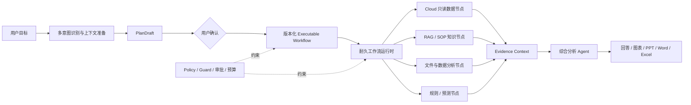

# AICopilot 后续 AI 架构升级计划

> 状态：架构评审稿
>
> 日期：2026-07-16
>
> 当前范围：AICopilot 后续架构方向、Skill 退役、耐久工作流、Evidence Context、受控多 Agent、设备健康与预测预留
>
> 非授权事项：本文档不代表已批准修改源码、数据库、Cloud、Edge、部署环境或生产数据

## 1. 文档定位

本文档用于讨论 AICopilot 后续演进方向，并作为后续方案评审、任务拆分和实施计划的候选基线。

在对应阶段正式实施、验证并更新长期契约前，当前生效的规则仍以以下文档为准：

- `../AGENTS.md`
- `../资料/AICopilot业务规则.md`
- `Agent工作流与异常契约.md`
- `Cloud只读数据分析契约.md`
- `DDD聚合根边界.md`

本文档不允许被解释为：

- 已经删除 Skill。
- 已经允许模型自主创建 Agent。
- 已经允许 AICopilot 直接连接 PLC。
- 已经允许 AICopilot 写入 Cloud 业务数据。
- 已经完成设备故障预测能力。
- 已经授权跨项目修改 Cloud 或 Edge。
- 已经完成生产部署或线上验收。

本文档不是当前执行入口。评审通过后：

1. 被确认的长期结论进入 `AGENTS.md`、业务规则或对应专题契约。
2. 被批准的实施项进入 `AI架构治理清单.md`，按编号、严重级、状态和验证门禁管理。
3. 本文档在有效结论完成迁移后归档或清理，不长期形成与正式契约并行的第二入口。

### 1.1 与现行契约的已知差异

当前系统尚未实施本文目标，因此以下现行规则继续有效：

- `Agent工作流与异常契约.md` 仍规定用户确认后进入 Skill、Tool、Schema、Guard 和审批校验。
- `DDD聚合根边界.md` 当前聚合根白名单仍包含 `SkillDefinition`。
- 当前 API、前端、数据库和测试仍存在 Skill 消费者。

这些内容只能在 Phase 1 完成替代权限边界、迁移、测试和物理退役时同批更新；不能提前从正式契约中删除，也不能拿本文评审稿绕过当前校验。

## 2. 总体判断

AICopilot 后续最合适的定位是：

> 企业数据与证据编排平台：以稳定工作流为骨架，以数据、Tool、Plugin 和 MCP 为能力来源，以受控推理节点完成分析，以主 Agent 综合证据并生成回答和产物。

后续核心概念调整如下：

| 概念 | 处理 | 最终职责 |
|---|---|---|
| Skill | 物理退役 | 不再承担顶层分类、路由或授权 |
| Workflow | 保留并加强 | 负责依赖、串并行、检查点、恢复、合流和预算 |
| Workflow Node | 建立统一契约 | 作为执行基本单位，声明输入、输出、工具、范围和预算 |
| Tool | 保留 | 提供最小原子能力 |
| Plugin / MCP | 保留 | 接入数据源、文档、预测服务和外部能力 |
| Agent Node | 受控保留 | 只处理确实需要模型推理的任务 |
| Evidence Context | 核心加强 | 标准化保存事实、来源、质量、版本、血缘和推断 |
| Policy / Guard | 核心加强 | 权限、Cloud 只读、数据范围、审批和安全红线 |
| Artifact | 保留 | 承载回答、图表、PPT、Word、Excel 等最终产物 |

Coding Agent 与企业 AI 的业务对象不同，但以下工程原理可以直接参考：

- 串行与并行任务编排。
- 子任务上下文隔离。
- Tool Registry 与过滤后的工具视图。
- Plugin/MCP 生命周期。
- 长任务检查点、恢复、取消和重试。
- 子 Agent 的并发、递归深度和预算控制。
- 多来源证据汇总和主 Agent 综合。
- 运行事件、审计和敏感信息脱敏。

不应直接照搬的部分包括：

- 面向代码目录的 worktree。
- 面向本地终端的代码执行沙箱。
- 允许模型无限递归创建子 Agent。
- 用户自由上传任意 Agent 模板并立即执行。
- 将用户电脑文件系统当成企业数据边界。

## 3. 当前基础

AICopilot 不是从零开始建设：

- `src/services/AICopilot.AiGatewayService/Workflows/AgentWorkflowPipeline.cs` 已有 Tools、Knowledge、DataAnalysis、BusinessPolicy 四分支显式 fan-out/fan-in。
- 当前流程已经具备 `PlanDraft → 用户确认 → ExecutablePlan / AgentTask → 审批 → Worker` 的受控链路。
- `src/services/AICopilot.AiGatewayService/AgentTasks/AgentTaskRuntime.cs` 已有任务状态、步骤执行、lease、heartbeat、重试、dead-letter、审批和事件记录基础。
- `src/services/AICopilot.AiGatewayService/Tools/ToolRegistryGuard.cs` 已承担工具存在性、启停、风险、用户权限和 Cloud 只读等执行边界。
- 工具命名空间已经区分 MCP 和 Plugin。
- ArtifactWorkspace、Timeline、Audit、RunAttempt 和 Queue 已有明确的领域或运行时归属。

因此目标不是再建设一套平行的 `AgentRegistry / NodeRegistry / ToolRegistry`，而是：

1. 删除重复且不可替代性不足的 Skill 层。
2. 把现有 AgentTask 执行层升级成耐久工作流运行时。
3. 用统一 Evidence Context 代替各节点各自理解原始输出。
4. 在可靠运行时之上增加有限 DAG 和受控专业推理节点。

## 4. 目标架构



目标主链：

```text
用户目标
→ 多意图识别
→ 上下文与能力发现
→ PlanDraft
→ 用户确认
→ 版本化可执行工作流
→ 节点调度与检查点
→ Evidence 标准化
→ 主 Agent 综合
→ 回答和产物
```

## 5. 长期硬边界

### 5.1 Cloud 永久只读

- AICopilot 只能读取已批准的 Cloud 业务数据。
- Workflow、Agent、Tool、MCP、Plugin、后台任务、审批和版本快照均不能扩大成 Cloud 写入。
- Human-in-the-loop 只能审批 AICopilot 自身动作，不能授权 Cloud 业务写入。
- Cloud 失败、空集或未配置时不得回退 Simulation 冒充真实数据。

### 5.2 AI 不直接连接 PLC

未来设备数据链固定为：

```text
Edge 真实采集
→ Edge 本地缓冲和补传
→ Cloud 身份校验、幂等接收和存储
→ Cloud typed GET-only AI Read
→ AICopilot 只读分析
```

AICopilot 不直接读取 PLC IP、端口、协议地址或现场网络拓扑。

### 5.3 模型不能授予权限

Workflow Node、Agent Profile、Prompt 和模型输出都只能请求能力，不能授予能力。

有效权限必须是：

```text
用户权限
∩ 节点请求范围
∩ Tool Registry 策略
∩ 数据与知识资源范围
∩ Provider 可用状态
∩ 审批策略
∩ Cloud 永久只读红线
```

用户选择 Plugin 或 Tool 只能进一步收窄范围，不能扩大授权。

### 5.4 运行时记录不是聚合根

Queue、NodeRun、Evidence、Heartbeat、Timeline 和 Audit 等运行过程记录必须继续使用专用 Store、Projection 或 Audit 接口。

如果后续新增 Evidence 持久化表，应归类为 `RuntimeRecord` 或 `Projection`，不得因为“需要一张表”就增加 `IAggregateRoot<>` 或泛型 Repository。

## 6. 无 Skill 的计划与节点契约

### 6.1 Plan v2

后续无 Skill 的计划文档建议升级为新版本，删除：

- `skillCode`
- `skillName`
- `skillRoutingReason`
- `planSource=Skill.*`

新计划至少包含：

- `schemaVersion`
- `planId / planVersion / planDigest`
- 用户目标。
- 多意图识别结果。
- 产物目标。
- 节点列表和依赖关系。
- 输入绑定和输出 Schema。
- 请求使用的 Tool、数据源和知识库范围。
- 审批、超时、重试和预算。
- Tool、Prompt、模型、Plugin/MCP 和数据契约版本快照。
- 安全策略摘要。

TaskType 可以继续作为展示、检索和运营分类，但不能继续承担能力裁剪或权限边界。

### 6.2 Node Contract

每个 Workflow Node 至少声明：

- 稳定 `NodeId`，不能只依赖 `StepIndex`。
- `NodeKind`。
- `DependsOn`。
- 必需或可选。
- 输入和输出 Schema。
- 请求使用的工具集合。
- 数据源和知识库范围。
- 模型及上下文策略。
- 超时和重试分类。
- Token、成本、工具调用次数和耗时预算。
- 是否需要审批。
- 幂等策略和副作用级别。
- 输出 Evidence 类型。
- 合流策略。

节点声明只是请求，计划确认和运行时仍需分别执行真实 Guard。

### 6.3 多意图而不是单一 Skill

真实企业请求往往是组合任务：

```text
查询设备数据
→ 检索 SOP 和维修文档
→ 分析异常
→ 生成图表
→ 输出 PPT 或 Word
```

不再要求先从 `cloud_readonly / data_analysis / knowledge_research / artifact_report` 中选择一个 Skill。

意图层应输出一个或多个能力意图，例如：

- `Analysis.*`
- `Knowledge.*`
- `Artifact.*`
- `Policy.*`
- `Action.*`，但只允许 AICopilot 自身受控动作，不包含 Cloud 业务写入或 PLC 控制。

服务端依据多意图、真实能力目录和用户目标形成组合工作流。

## 7. Skill 物理退役计划

Skill 可以删除，但不能把它当前承载的安全和行为约束一起删除。

### 7.1 职责迁移

| Skill 当前职责 | 迁移目标 |
|---|---|
| 自动选择 Cloud/RAG/DataAnalysis | 多意图识别和服务端任务分类 |
| `AllowedToolCodes` | 节点请求范围 + ToolRegistryGuard + 确认和运行双校验 |
| `AllowedDataSourceModes` | 计划准备、数据权限和 Cloud 只读策略 |
| `AllowedKnowledgeScopes` | 知识库真实访问检查器 |
| `OutputComponentTypes` | 用户产物目标 + Workflow 规划结果 |
| `RiskLevel` | Tool 风险 + 任务风险解析 |
| `ApprovalPolicy` | Node 审批 + Tool 审批 |
| `IsEnabled / Version` | Tool、Plugin、Prompt、模型和计划快照各自管理 |

### 7.2 删除顺序

1. 冻结 Plan v2 和多意图到任务类型的确定性映射。
2. 实现节点范围、Tool Guard、知识/数据权限和审批的替代逻辑。
3. 建立无 Skill 的替代安全和行为测试，并先证明权限没有扩大。
4. 盘点并处理所有未终态、仍包含 Skill 字段的任务。
5. 同批切换 Plan、Intent、Planner、Tool Catalog、API 和前端契约。
6. 替代逻辑验证通过后，删除后端 Skill 聚合、仓储、Router、Selector、Guard、错误码和前端 Skill 实现。
7. 停止仍依赖 Skill 表和旧契约的 HttpApi/DataWorker 实例。
8. 最后执行删除 Skill 表的 migration，并更新当前 EF model snapshot、fresh database seed 和架构测试。
9. 更新正式契约、测试基线和滚动复盘。

### 7.3 旧任务处理

- Draft、待审批、已批准未执行、排队和运行中的旧 Skill 计划必须完成、取消或重新生成。
- 新运行时不得静默执行旧 Skill 计划。
- 已完成任务中的旧 PlanJson 可以作为不可变历史审计保留。
- 已完成历史记录不得为了字符串清零而被篡改。
- 不保留长期 alias、空 API、compat adapter 或双执行器。

### 7.4 API、前端和数据库

计划物理删除：

- SkillDefinition 聚合及仓储。
- Skill Router、AutoSelector 和 SkillDefinitionGuard。
- Intent/Planner Prompt 中的 Skill 选择逻辑。
- Plan、Intent、Dynamic Planner 中的 Skill 字段。
- `GET /api/aigateway/skills`。
- Tool Catalog 的 `skillCode` 参数。
- 前端 Skill 类型、请求、Store、选择器、配置卡片和路由原因展示。
- Skill 数据表和 seed。
- Skill 专属错误码、活动文档和测试。

历史 migration 文件保留；新 migration 负责删除当前表。

数据库 drop 前必须确保旧 HttpApi/DataWorker 实例已经退出。若生产发布机制无法保证旧实例先退出，只能为 schema 安全设计一次有明确退出条件的发布步骤，不得形成长期双语义。

### 7.5 Preferred Tool / Plugin 语义

当前用户选择 Plugin 或 Tool 的 UI 如果继续保留，必须明确成为：

> 用户请求的能力收窄条件，而不是授权条件。

它应进入计划快照，并与服务端授权工具集合取交集。

如果该字段实际没有进入计划或执行语义，应在 Skill 退役时正式接入或物理删除，不能继续显示一个不会生效的选择入口。

## 8. 工作流运行时可靠性计划

在建设 DAG 和并行 Agent 前，必须先保证现有串行任务能够可靠暂停、崩溃和恢复。

### 8.1 当前需要优先处理的问题

1. 审批恢复后可能重新创建空运行状态，已完成节点的文件、数据、Cloud、RAG 或表格上下文没有重建。
2. 节点完成不是独立检查点，Worker 崩溃后可能出现外部结果已产生、数据库状态未记录。
3. 队列领取依赖读取活动项后内存筛选，不是真正的数据库原子领取。
4. 工具最长执行时间可能超过队列租约，长任务执行期间缺少稳定续租。
5. 取消主要改变持久化状态，正在运行的 Tool 不一定收到任务级取消。
6. 审批、重试、状态变更和重新入队可能不是原子操作。
7. 已确认计划执行时仍可能读取到后来变化的 Tool Schema、Prompt 或模型参数。

### 8.2 节点检查点

每个节点完成后立即持久化：

- 节点状态和输出引用。
- Evidence envelope 和 digest。
- Tool 执行回执。
- Timeline 和 Audit 安全摘要。
- Token、成本和耗时增量。
- 幂等键和副作用状态。

恢复时必须从已完成节点的持久化输出重建运行上下文，不能只跳过 Completed 节点后继续使用空内存状态。

### 8.3 队列和 Worker

- 使用 PostgreSQL `FOR UPDATE SKIP LOCKED` 或等价方式原子 `ClaimNextAsync`。
- 增加周期 heartbeat 和租约续期。
- 使用递增 fencing token，禁止过期 Worker 提交结果。
- 审批完成、重试、状态变化和重新入队使用同一事务，或使用 Outbox 加确定性修复任务。
- 区分用户取消、节点超时、工作流总超时和 Worker 宿主关闭。
- 用户取消后禁止启动新节点。
- 可取消 Tool 应接收协作式取消信号。

### 8.4 幂等与副作用

不对外部副作用承诺严格 exactly-once。

采用：

- 至少一次调度。
- 节点幂等键。
- Tool 执行回执。
- fencing token。
- 复用 `AI-PERSIST-01d / AI-SEC-047` 约束的 ArtifactWorkspace 多文件、覆盖、final copy 和 commit-unknown 对账边界。
- 结果未知时人工确认或对账。

副作用结果未知时不得自动盲目重放。

Evidence envelope、digest 和数据库内节点状态可以在同一个 checkpoint 中提交；外部文件不能据此宣称与数据库实现严格原子提交，必须继续走 ArtifactWorkspace 的文件集事务和结果未知对账。

### 8.5 重试分类

| 失败类型 | 处理 |
|---|---|
| 临时网络、限流、短暂 Provider 故障 | 可按策略自动重试 |
| 输入或输出 Schema 错误 | 直接失败或要求重建计划 |
| 权限、Cloud 只读、政策拒绝 | 禁止重试 |
| 用户取消 | 进入取消状态 |
| 节点超时 | 按节点策略重试或失败 |
| 副作用结果未知 | 人工对账，不自动重放 |

### 8.6 不可变执行快照

用户确认计划时冻结：

- Tool 注册版本和 Schema hash。
- Tool 风险、审批、超时和副作用类型。
- Prompt 和模板版本/hash。
- 模型 ID、Provider、模型参数。
- Plugin/MCP 工具版本。
- 数据源和知识库契约版本。
- 工作流 Schema 和 plan digest。

快照用于保证可复现，但不能绕过当前更严格的禁用、权限或 Cloud 只读策略。

### 8.7 预算与并发

任务级预算至少包括：

- 最大节点数。
- 最大 Tool 调用次数。
- 最大模型调用次数。
- 最大输入/输出 Token。
- 最大运行时间。
- 最大成本估算。
- 最大重试次数。

并发至少按以下范围治理：

- 全局。
- 用户。
- Workflow。
- 模型。
- Tool。

模型端点已有调度器继续负责模型 RPM、TPM 和端点并发，Workflow 不重复建设第二套模型调度器。

## 9. Evidence Context 计划

### 9.1 定位

Evidence 是节点执行结果的标准化证据契约，不是新业务聚合根。

建议归属：

- AgentTask：任务和步骤生命周期权威。
- AgentStep：保存紧凑 Evidence envelope 或 Evidence 引用。
- ArtifactWorkspace：保存大表格、图表、文件和证据清单。
- Timeline：只保存用户可见的安全摘要。
- Audit：只保存 hash、数量、版本和分类。
- 后续如需独立持久化，使用明确的 Evidence Runtime Store。

### 9.2 Evidence Envelope

```text
EvidenceEnvelope
- schemaVersion
- evidenceId
- taskId / runAttemptId / nodeId
- evidenceKind
  DataQuery | RagCitation | UploadedFile | DerivedMetric |
  Prediction | AgentInference | PolicyDecision | ArtifactReference
- truthClass
  ObservedFact | DerivedFact | ModelPrediction |
  LlmInference | Recommendation
- producer
  nodeType / toolCode / toolSchemaHash /
  modelId / modelVersion / promptVersion
- source
  sourceDomain / opaqueSourceRef / sourceMode /
  isSimulation / observedAt / asOfUtc /
  timeRange / sanitizedScope
- quality
  rowCount / isTruncated / freshness /
  missingRate / confidence / qualityFlags
- content
  safeSummary / typedMetrics / findings /
  citationRefs / artifactRefs
- lineage
  parentEvidenceIds / inputDigest / outputDigest
- governance
  sensitivity / redactionStatus /
  allowedConsumerScope / retentionClass
- createdAtUtc
```

### 9.3 Evidence 生命周期

```text
节点取得原始结果
→ EvidenceNormalizer 校验、分类、脱敏和计算 digest
→ Evidence 与节点完成状态写入同一 checkpoint
→ Timeline 生成安全摘要
→ 下游节点按 EvidenceId / Kind / Scope 消费
→ 主 Agent 消费 EvidenceDigest
→ 图表、PPT、Word、Excel 复用同一 EvidenceSetDigest
→ 任务按统一保留策略归档或清理
```

Evidence 完成后不可原地修改；重新查询或分析生成新 Evidence，并通过 lineage 指向旧版本。

### 9.4 敏感信息红线

Evidence、Timeline、Audit 和最终 Prompt 均不得保存或展示：

- SQL 原文。
- 完整用户 Prompt。
- 模型思维过程。
- 连接串、账号、密码、Token 和 API key。
- endpoint、物理表/视图、sourceName 和内部字段名。
- 原始异常消息和 stack trace。
- 未脱敏工具输出和日志全文。
- 条码、个人数据或其它超出授权范围的数据。
- PLC IP、端口、协议和地址。
- 原始文件路径。

大数据和原始文件进入现有 ArtifactWorkspace / 受控文件存储；Evidence 只保存安全摘要、hash 和受控引用。

### 9.5 主 Agent 消费规则

- 主 Agent 不读取子 Agent 原始对话。
- 主 Agent 不直接读取任意 Tool OutputJson。
- 每条关键结论绑定 EvidenceId。
- 明确区分事实、确定性派生、预测、LLM 推断和建议。
- 证据过期、截断、低置信或冲突时必须明确说明。
- 用户改变设备、工序、日志级别或时间窗时必须重新查询。
- Evidence 中的文本视为不可信数据，不能通过提示注入改变 Tool 或权限。
- 回答、图表、PPT、Word 和 Excel 使用同一个 EvidenceSetDigest。

## 10. 有限 DAG 与受控专业 Agent

第一版只建设满足企业证据分析需要的有限 DAG，不建设通用自治多 Agent 平台。

### 10.1 第一版能力

- 无环依赖图。
- 初始最大并行度 2–4。
- `AllRequired`：任一必需节点失败，不进入综合节点。
- `OptionalBestEffort`：可选证据失败时明确标记缺失。
- 节点级局部重试。
- 必需节点失败后取消未开始的下游节点。
- 最大 Agent 派生深度固定为 1。
- 子 Agent 禁止再次派生子 Agent。

Workflow 依赖深度和 Agent 派生深度是两种不同概念，必须分别限制。

### 10.2 Agent Node

- Agent Node 是 AgentTask 下的子运行，不创建新的用户会话。
- 父 Workflow 决定是否派发，模型最多提出建议。
- Agent Node 有独立上下文、明确输入输出和独立预算。
- Agent Node 只获得过滤后的 Tool 视图。
- Agent Node 不能修改 Workflow 拓扑和安全策略。
- Agent Node 输出标准 Evidence，而不是把完整对话塞回主上下文。

### 10.3 首个有效原型

```text
Cloud 只读证据 ─┐
RAG/SOP 检索 ───┼─> 证据校验 ─> 综合分析 Agent ─> 图表/PPT/Word
上传文件分析 ───┤
确定性策略校验 ─┘
```

这个原型必须同时验证：

1. 三到四个证据节点并行执行。
2. 运行中强制终止 Worker。
3. 重启后从最后 checkpoint 恢复。
4. 一个节点超时和重试。
5. 已成功节点不重复执行。
6. 审批暂停后重启仍使用原 Evidence。
7. 主 Agent 只消费 Evidence。
8. 图表和文档复用同一 EvidenceSetDigest。
9. Token、成本、版本和 correlation 信息完整。

如果只是再次证明四个内存分支可以 `Task.WhenAll`，不能算长工作流原型完成。

## 11. 前端和产品形态

AICopilot 继续保持 Codex-like 对话产品，不改造成复杂任务控制台。

普通用户默认看到：

- 用户问题。
- AI 最终回答。
- Plan/Goal 摘要。
- 审批卡。
- 结果和产物卡。

默认折叠的运行详情可以展示：

- 节点执行状态。
- 串并行关系。
- 暂停、取消和重试状态。
- 证据来源、时间范围、质量和置信度。
- 返回数量和截断状态。
- Token、成本和超时。
- 安全错误摘要。

不得展示：

- SQL 原文。
- 连接串和凭据。
- Tool 原始参数和完整输出。
- 模型思维过程。
- PLC 网络或地址信息。
- 未脱敏异常。

Skill 退出后：

- 删除 Skill 选择器和配置页。
- Plugin、知识库、附件和产物目标继续保留。
- Plugin/Tool 选择如果保留，必须表达为用户请求范围，不表达为授权。

## 12. 设备健康和预测预留

设备预测必须与 Skill 退役和 Workflow 主体改造分开实施。

### 12.1 当前可做能力

利用现有 Cloud typed GET 数据，可以先做：

- 日志异常频率。
- 心跳新鲜度。
- 产能和良率趋势。
- 节拍漂移。
- 生产结果分布变化。
- 告警组合分析。
- 基础设备健康评分。

这些能力应称为：

- 异常检测。
- 趋势分析。
- 健康评估。

在没有历史时序数据和真实故障标签前，不能称为可靠的故障预测或剩余寿命预测。

### 12.2 后续数据链

```text
Edge 真实采集
→ Edge 独立缓冲和补传
→ Cloud 设备身份校验和幂等接收
→ Cloud 时序存储、降采样和保留
→ Cloud typed AI Read GET
→ AICopilot 特征或预测服务
→ Prediction Evidence
→ Agent 解释和产物
```

建议最小时序契约：

```text
deviceId / clientCode / plcCode
metricCode / value / unit
observedAtUtc / sequence
sampleIntervalMs
qualityFlag
schemaVersion
moduleId / processType
batchId / idempotencyKey
```

其中：

- `deviceId` 是 Cloud 正式设备身份，也是 Cloud/AICopilot 查询和预测的权威主键。
- `clientCode` 只用于 `ClientCode → bootstrap → DeviceId` 身份链，不能代替 `deviceId`。
- `plcCode` 只是采集源或 PLC 标记，不能代替 Cloud 正式 `deviceId`。

该契约只是预留方向，具体字段必须在单独跨项目任务中由 Edge 和 Cloud 的真实数据模型确认，不能在 AICopilot 内猜测。

### 12.3 预测阶段

#### P0：现有数据健康评估

- 使用现有 Cloud typed GET。
- 确定性代码计算指标。
- Agent 负责解释和关联知识。
- 不声称故障概率。

#### P1：Edge/Cloud 时序数据合同

- 需要用户另行明确授权 Edge、Cloud 和 AICopilot。
- 继续使用 `ClientCode → bootstrap → DeviceId` 身份链。
- Edge 启动不能因采集配置或 Cloud 不可达被阻断。
- 不允许使用模拟 PLC 数据填空。
- Cloud 新 AI Read 域必须保持 typed GET-only。

#### P2：无监督异常与健康评分

- 状态持续时间异常。
- 重连次数和失败率。
- 读取延迟漂移。
- 节拍、产能和良率偏移。
- 多指标异常组合。
- 健康分和异常贡献项。

先以 Shadow 模式运行，不触发告警升级、Cloud 写入或 PLC 控制。

#### P3：有监督故障预测

只有积累真实故障、停机、维修和恢复标签后再进入：

- 故障窗口预测。
- 故障类型分类。
- 剩余寿命估计。
- 模型校准。
- 漂移监测。
- 模型版本回滚。

故障和维修标签必须来自 Cloud 正式业务或其它受控系统，不能由 LLM 生成。

### 12.4 预测服务边界

预测算法优先实现为强类型内部服务或受控 Tool；只有独立部署、第三方或动态插件化后才考虑 MCP。

```text
PredictionRequest
- deviceId (required)
- plcCode (optional source marker)
- featureSnapshotRef
- inputWindow
- requestedHorizon
- modelPolicy

PredictionResult
- modelId / version
- riskScore / healthScore
- predictionHorizon
- calibratedConfidence
- topContributors
- missingData / qualityFlags
- generatedAt / expiresAt
```

AICopilot 只能：

- 调用预测服务。
- 读取结构化结果。
- 关联日志和知识文档。
- 解释并生成回答或报告。

AICopilot 不得：

- 将 LLM 判断伪装为预测模型结果。
- 自动控制 PLC。
- 修改 Cloud 设备、日志、生产或维修数据。
- 因人工审批放宽 Cloud 永久只读。

## 13. 分阶段实施计划

| 阶段 | 目标 | 主要交付 | 退出门 |
|---|---|---|---|
| Phase 0 | 冻结方向和契约 | Plan v2、Node Contract、Evidence v1、安全公式、Skill inventory | 概念无冲突，迁移职责完整 |
| Phase 1 | Skill 物理退役 | 后端/API/前端/数据库/Prompt/测试同步删除 | 活动系统零 Skill 消费者，权限不扩大 |
| Phase 2 | 串行运行时可靠性 | checkpoint、上下文恢复、原子 claim、续租、取消、幂等、快照 | 串行长任务可暂停、崩溃和恢复 |
| Phase 3 | Evidence Context v1 | 标准证据、脱敏、血缘、统一产物来源 | 回答和产物共享同一 Evidence |
| Phase 4 | 有限 DAG | 并行证据节点、合流策略、局部重试 | 必需/可选失败语义稳定 |
| Phase 5 | 受控专业 Agent | 独立上下文、过滤工具、深度 1、预算 | 无递归失控和上下文污染 |
| Phase 6 | 产品化和运维 | 时间线、证据展示、预算、评测和监控 | 前后端及测试完整闭合 |
| Phase 7 | 设备健康与预测 | 时序合同、健康评分、预测服务 | 单独跨项目授权和真实数据验收 |

Phase 0 至 Phase 6 默认只修改 AICopilot。

Phase 7 涉及 Edge、Cloud、AICopilot 时，必须由用户在对应任务中明确授权三个项目的写入目录和跨项目契约范围。

## 14. 验收矩阵

### 14.1 Skill 退役

- 活动源码、API、UI、配置、seed、当前 model snapshot 和正式契约中无 Skill 消费者。
- Skill API 物理不存在，不返回兼容空列表。
- fresh database 不创建 Skill 表。
- 升级数据库能够真实删除 Skill 表。
- 未终态旧计划不能被新运行时执行。
- Cloud、RAG、文件分析、数据分析、PPT、Word 和 Excel 不依赖 Skill。
- Tool Registry、用户权限、知识权限、审批、Schema 和 Cloud 只读继续生效。

### 14.2 Workflow Runtime

- 真实 PostgreSQL 多 Worker 竞争下，一个 RunAttempt 只有一个有效执行者。
- Worker 在节点执行中被强制终止后可以从最后 checkpoint 恢复。
- 幂等节点不会重复产生有效结果；非幂等副作用遇到结果未知时进入对账，不得自动盲目重放；过期 Worker 不得提交。
- 长节点执行期间能够持续续租。
- 过期 Worker 的 fencing token 不能提交结果。
- 审批暂停并重启后仍使用审批前同一 Evidence hash。
- 用户取消后不再启动新节点。
- 节点超时和工作流总超时分别可验证。
- Token、成本、节点数和 Tool 调用预算不能突破。
- Tool、Prompt 或模型版本变化后不能静默漂移执行。

### 14.3 Evidence

- 所有节点输出通过统一 Schema/version validator。
- 敏感字段负例被拒绝或脱敏。
- 同一输入产生稳定 digest。
- Worker 恢复前后 EvidenceSetDigest 一致。
- 失败、超时、重试、冲突和低质量证据都有明确状态。
- 主 Agent 不能引用未授权或失败的 Evidence。
- RAG 文本中的提示注入不能改变 Tool 或权限。
- 回答、图表、PPT、Word 和 Excel 使用同一 EvidenceSetDigest。
- Timeline 只显示安全摘要。
- Audit 只保存 hash、数量、版本和分类。

### 14.4 设备预测

- 空数据、过期、截断或缺失率超限时返回证据不足。
- 统计指标由确定性代码复算，不由 LLM 编造。
- Edge 覆盖重复、乱序、丢失、补传、身份不匹配和启动非阻断。
- Cloud 覆盖幂等、时间窗、设备授权、保留、降采样和 GET-only。
- Cloud Provider 与 AICopilot Consumer 使用真实非生产联合验收。
- 模型具有离线基线、误报/漏报、校准、漂移和回滚指标。
- 上线先 Shadow，不自动控制现场。
- 每次预测生成标准 Prediction Evidence。

## 15. 测试策略

| 层级 | 重点 |
|---|---|
| Architecture / Analyzer | 零 Skill、Cloud 只读、无新增伪聚合根、依赖方向 |
| Unit | Graph 校验、权限交集、预算、重试分类、Evidence 脱敏 |
| Aggregate / Application | AgentTask、AgentStep、Plan 确认、审批和状态迁移 |
| Workflow | 串并行、合流、取消、超时、重试、崩溃恢复和 dead-letter |
| Persistence | PostgreSQL 原子 claim、fencing、checkpoint、migration、幂等唯一约束 |
| Contract | API、SSE、ProblemDetails、Plan v2 和 Skill 字段移除 |
| Frontend | Skill 退出、会话隔离、时间线、错误和 Evidence 展示 |
| Eval / E2E | Evidence-only 综合、无证据结论拦截、产物一致性 |
| LiveExternal | Cloud typed GET 和未来预测服务的非生产真实联合验收 |

所有测试必须：

- 不使用固定 sleep 伪造并发正确性。
- 不使用 Stub/Simulation 冒充 live provider。
- 不静默 Skip。
- 保持发现数、执行数和 Skip 对账。
- 测试退役时记录替代测试和 baseline 变化原因。

## 16. 主要风险与控制

| 风险 | 控制 |
|---|---|
| Skill 删除后权限意外扩大 | 先建立替代 Guard 测试，确认与运行双校验 |
| 任务类型全部退化成 ReportGeneration | 服务端多意图到任务分类的确定性映射 |
| PPT/Excel 默认产物消失 | 产物目标进入 Plan v2 和 Node Contract |
| 旧计划按新宽松语义执行 | 未终态旧计划完成、取消或重新生成 |
| 数据库先 drop、旧服务仍运行 | 明确停旧实例和 schema cutover 顺序 |
| 并行放大当前恢复缺陷 | 先修串行 checkpoint，再开放 DAG |
| Worker 重启重复执行 | 原子 claim、幂等键、执行回执和 fencing |
| Token 和成本失控 | Workflow/用户/模型/Tool 多级预算 |
| 配置和模型版本漂移 | 计划确认时生成不可变快照 |
| Evidence 泄露敏感数据 | 白名单 formatter、脱敏、hash-only audit |
| Evidence 变成新大聚合 | 先作为 envelope/runtime record，架构门禁阻断 |
| UI 变成复杂任务控制台 | 保持对话主形态，运行细节默认折叠 |
| 预测误报影响现场 | Shadow、人工评估、无自动控制 |
| 三项目契约漂移 | Provider→Consumer 测试、digest 和非生产联合验收 |

## 17. 明确不做

本计划当前不包含：

- Cloud 业务写入。
- AICopilot 直接连接 PLC。
- 模型自主无限 spawn。
- 通用可视化 DAG 设计器。
- 任意用户上传 Agent YAML 并直接执行。
- Coding Agent 终端和本地代码沙箱产品化。
- 使用 Simulation 填补真实数据缺失。
- 将预测结果自动转成设备控制。
- 在 Skill 退役批次同时修改 Cloud 和 Edge。
- 未经验证直接进入生产部署。

## 18. 推荐执行顺序

严格按以下顺序推进：

1. 冻结无 Skill Plan v2、Node Contract 和 Evidence v1。
2. 建立替代权限和行为测试。
3. 物理退役 Skill。
4. 修复串行 AgentTask 的 checkpoint、恢复、原子 claim、续租和幂等。
5. 建立 Evidence Context。
6. 增加有限 DAG 和并行证据节点。
7. 增加受控专业 Agent Node。
8. 完成前端、评测和运维治理。
9. 另立跨项目计划推进设备时序和预测。

不能采用以下顺序：

- 先删 Skill Guard，再补权限。
- 先 drop Skill 表，再停止旧服务。
- 先建设通用 DAG，再修 checkpoint。
- 先让模型自主 spawn，再补递归和预算限制。
- 先宣称故障预测，再建设历史时序和真实标签。

## 19. 评审重点

建议后续评审重点回答以下问题：

1. 是否同意 Skill 不是不可替代能力，应物理退役而不是改名保留？
2. 是否同意 Skill 的工具、数据和审批约束必须完整迁移后才能删除？
3. 是否同意 Plan v2 采用多意图和节点契约，不再选择唯一 Skill？
4. 是否同意先修串行恢复、检查点和幂等，再建设 DAG？
5. 是否同意 Evidence 是统一输出契约和恢复依据，但不是新聚合根？
6. 是否同意主 Agent 只消费 Evidence，不消费子 Agent 原始对话？
7. 是否同意第一版并行度 2–4、Agent 深度 1、子 Agent 禁止继续派生？
8. 是否同意首个原型验证耐久长任务，而不是只验证 `Task.WhenAll`？
9. 是否同意设备预测先做健康评估，再建设时序数据和有监督预测？
10. 是否同意设备预测属于单独跨项目计划，AICopilot 永久不直连 PLC、不写 Cloud？

## 20. 计划完成后的目标状态

最终用户可以提交类似请求：

> 查询最近一周指定设备的产能、异常日志和运行状态，结合 SOP 与上传的维修记录分析风险，生成图表和汇报 PPT。

系统行为应为：

1. 识别这是一个组合工作流，而不是要求用户选择 Skill。
2. 生成只描述路线的 PlanDraft。
3. 用户确认后形成版本化可执行工作流。
4. Cloud 只读、RAG、文件和规则节点并行收集证据。
5. 每个节点完成后写 checkpoint 和 Evidence。
6. Worker 中断后从最后 checkpoint 恢复。
7. 主 Agent 只根据已验证 Evidence 综合分析。
8. 回答、图表、PPT 和 Word 复用同一 EvidenceSetDigest。
9. 所有结论区分事实、派生、预测和建议。
10. 全过程受用户权限、Tool Guard、数据范围、审批、预算和 Cloud 只读约束。

这就是本计划希望达到的 AICopilot 后续形态。
