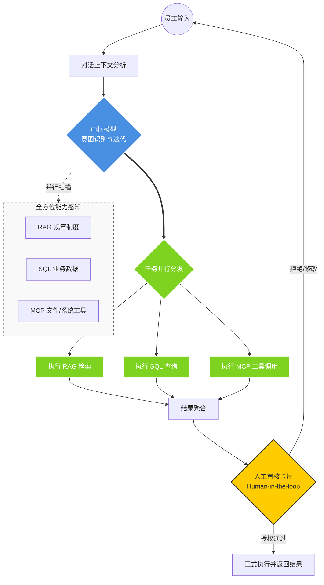

# AICopilot 全能型企业 AI 助理：核心功能总览

## 定位：企业级“感知-决策-执行”一体化调度平台

AICopilot 不仅是一个聊天窗口，它是一个由**分层模型**驱动，集成了**私有知识、实时数据、自动化工具**和**人工风控**的智能调度中心。

------

## 核心功能模块清单

### 1. 智能调度大脑（Intent Routing & Parallel Execution）

- **基础概念**：系统的“总指挥部”。
- **实现原理**：
  - **分层调度**：系统优先使用**中小型模型**进行快速“分流”，极大地降低响应延迟。
  - **并行识别**：AI 会同时扫描已接入的**插件（Plugin）**、**知识库（RAG）\**和\**业务数据库（SQL）**，判断用户一句话中包含的多个意图。
  - **自我迭代**：在内部推理过程中，AI 会反复确认：是否需要查库？是否需要翻阅手册？是否需要调用外部工具？
- **业务价值**：像真人助理一样，听懂需求后立刻分派任务到各个“部门”。

### 2. 自动化工具箱（MCP & Plugin System）

- **基础概念**：系统的“双手”。
- **实现原理**：
  - **MCP 协议**：采用最新的 **Model Context Protocol** 标准，支持 AI 跨平台读取和写入文件。
  - **动态插件**：通过 `AgentPluginLoader` 实时加载业务工具（如身份验证、系统操作、文件读写等）。
- **业务价值**：AI 不再“只说不做”，它可以直接帮您**修改文件、发送邮件、操作 ERP 系统**。

### 3. 数据分析专家（Text-to-SQL）

- **基础概念**：系统的“资深会计”。
- **实现原理**：
  - **语义转 SQL**：将员工的口语（如“看下北京上月业绩”）自动转化为专业的数据库查询语句。
  - **自动可视化**：查询结果会自动匹配最佳展现形式（柱状图、饼图、表格），并在前端直观展示。
- **业务价值**：让不懂技术的领导也能随时通过对话获取最新的经营数据。

### 4. 私有知识管家（RAG 检索）

- **基础概念**：系统的“企业百科全书”。
- **实现原理**：
  - **深度检索**：针对企业内部的 PDF、Word 等规章制度进行向量化存储和秒级检索。
  - **精准溯源**：所有回答都会标注出自哪一份文档、哪一页，杜绝 AI“胡编乱造”。
- **业务价值**：沉淀企业资产，让新员工、新业务能通过 AI 快速上手。

### 5. 安全护航员（Human-in-the-loop 人机协同）

- **基础概念**：系统的“监查委员会”。
- **实现原理**：
  - **关键指令审核**：对于文件写入、数据修改等高风险操作，系统会自动触发**人工确认流**，只有员工在界面点击“允许”，AI 才会执行。
- **业务价值**：确保 AI 的所有自动化行为都在人为管控下，符合企业合规要求。

------

## 系统的核心逻辑架构图

代码段

------

## 总结：AICopilot 的核心竞争力

1. **反应快**：通过模型分层分流，小事秒处理，大事才动用昂贵的大模型。
2. **懂得多**：实时感知企业现有的所有数据库、文档库和系统工具。
3. **干得实**：不仅能写诗，更能通过 MCP 协议写文件、写代码、操作数据库。
4. **守规矩**：通过人工审核机制，把 AI 锁在安全的笼子里。

