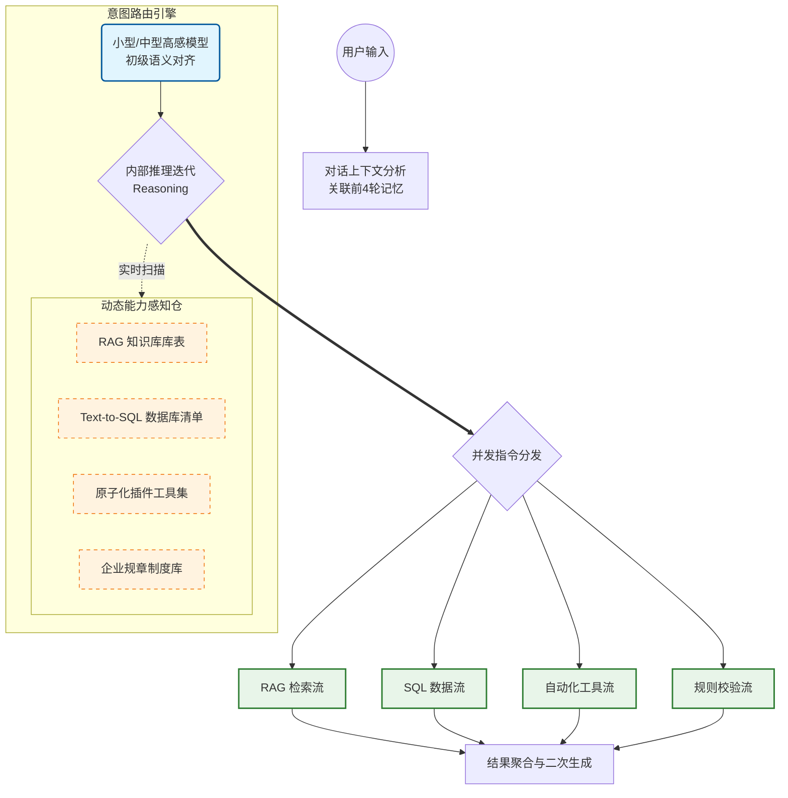

## 第一章：意图识别 —— 从“关键词匹配”到“神经网络调度”

### 1. 核心定位：它是系统的“神经总线”

在我们的架构中，意图识别不是一个简单的开关，而是一个**具备推理能力的调度中枢**。它解决了 AI 落地最难的问题：**如何在毫秒级时间内，从海量的企业资源中精准选中最合适的工具？**

### 2. 专业架构图：多轨并行执行逻辑

系统不再是“先问后答”的直线逻辑，而是**“全向感知、并行决策”**的网状架构。

代码段

------

### 3. 三大核心技术优势（专业视角）

#### A. 模型分层调度 (Hierarchical Model Strategy)

我们采用**“小模型定性，大模型定量”**的策略：

- **分诊模型**：系统首先使用响应极快的小型或中等模型进行初步“分诊”。这能极大地降低系统响应延迟，在 0.2 秒内完成意图捕捉。
- **意图对齐**：通过内部的推理逻辑，AI 会将用户的自然语言转化为结构化的任务清单。

#### B. 动态资源感知 (Dynamic Resource Awareness)

这是系统最强大的“工程能力”。`IntentRoutingAgent` 会在运行瞬间完成以下操作：

- **实时扫描**：自动检索当前已接入的所有知识库（RAG）、业务数据库（SQL）和插件工具（Tools）。
- **即插即用**：业务部门新增一个规章制度库或一套 ERP 报表，**不需要重启系统或修改代码**，AI 的意图引擎会自动感知到新技能，并开始指派任务。

#### C. 多轨并发执行 (Concurrent Workflow)

系统支持**“复合意图”**。

- **场景**：用户问“根据**《员工手册》**（RAG），帮我查下我上个月的**加班费**（SQL）对不对？”
- **执行**：意图引擎会识别出两个并行意图，同时触发知识库检索和数据库查询，最后由后端执行器进行结果汇总。这种并发性保证了复杂业务场景下的处理效率。

------

### 4. 业务价值：它为公司解决了什么？

1. **极速响应**：通过模型分层，避免了所有问题都去调用昂贵的大模型，既省钱又快速。
2. **决策透明**：每一项意图都有“推理过程”和“置信度评分”，我们能清晰看到 AI 为什么选这个工具，过程可审计、可优化。
3. **零配置扩展**：随着公司数据库和规章制度的增加，系统具备自我进化的能力，维护成本极低。