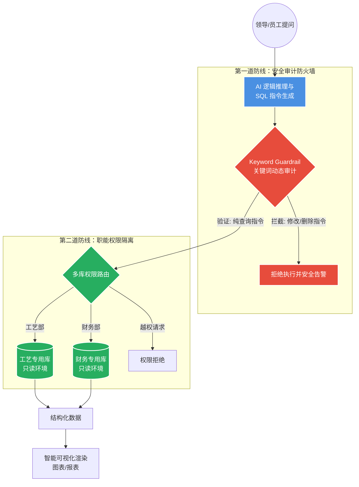

# 第三章：数据决策专家 —— Text-to-SQL 智能数据分析

### 1. 核心定位：打破“数据深沟”

该模块是系统的“金牌会计”，它让管理者无需学习复杂的编程语言，直接通过**自然语言**即可实时获取精准的业务报表。它的价值在于将“数据资产”秒变“决策依据”。

------

### 2. 运行流程与安全闭环图

代码段

------

### 3. 企业级安全与权限保障（技术护城河）

为了确保数据绝对安全，我们在代码底层构建了极为严苛的控制逻辑：

- **严密的“只读”指令审计 (Blacklist Filtering)**：

  系统内置了 SQL 安全护航机制。在指令发出前的最后一毫秒，会对所有语句进行强制性关键字扫描：

  - **高危拦截**：严禁执行任何修改数据的指令，如 **DELETE（删除）**、**UPDATE（更新）**、**INSERT（插入）**、**DROP（销毁表）** 等。
  - **注入防护**：自动拦截多行指令（分号注入）和注释绕过，确保 AI 只能乖乖地“看”数据，绝不能“动”数据。

- **物理级“只读环境”隔离 (Read-Only Environment)**：

  在正式落地时，系统仅被允许连接企业的**只读副本数据库**。这种物理层面的隔离意味着，即使 AI 逻辑出现偏差，也完全无法影响到企业生产系统的核心数据安全。

- **精细化的“职能权限”对齐 (Data Segregation)**：

  系统通过数据库标识（Name）和业务描述（Description）实现精准路由：

  - **数据隔离**：不同职能部门对应的数据库是完全隔离的。
  - **场景示例**：**工艺部**人员只能通过 AI 访问“工艺参数库”；**财务部**人员只能访问“成本审计库”。如果工艺部人员尝试打听财务数据，系统会在路由层直接阻断，实现“各司其职，数据不串门”。

------

### 4. 业务价值：从“看数据”到“看懂数据”

1. **安全合规**：通过黑名单审计与只读隔离，满足企业最严苛的安全审计要求。
2. **决策加速**：领导层不再需要等待 IT 汇总报表，随时提问，秒出结果。
3. **智能交互**：查询结果不再是冷冰冰的数字，系统会根据结果自动适配**趋势图、分布图或明细表**，让复杂数据一目了然。

