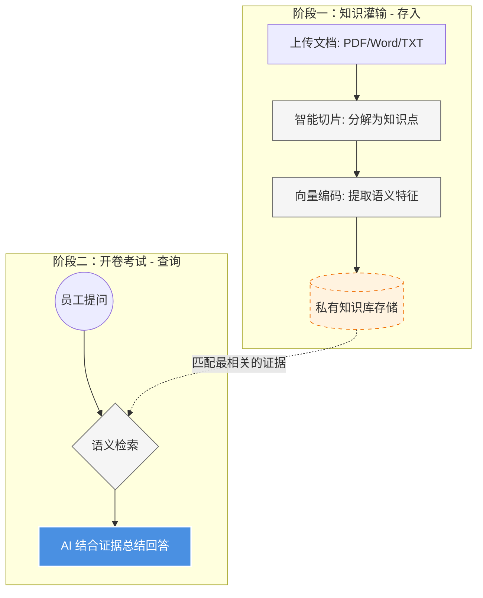

# 第二章：企业百科全书 —— RAG 智能知识库

### 1. 核心概念：什么是 RAG？

如果说意图识别是“总机”，那么 **RAG（检索增强生成）** 就是系统的“开卷考试”能力。

- **传统 AI**：像是一个虽然聪明但没读过公司文件的大学生，问他公司规章，他可能会“脑补”一个听起来很像但错误的答案（即 AI 幻觉）。
- **AICopilot 的 RAG**：像是一个手里拿着公司**所有手册、合同、报表**的专家。回答问题前，他会先去翻书，找到证据，然后再总结给你。

------

### 2. 运行流程图：从文档到答案

这个过程分为“知识灌输”和“开卷考试”两个阶段：

代码段

------

### 3. 我们在技术实现上的四个亮点

我们的系统在处理这些文档时，做得非常细腻：

- **多格式兼容 (Parser Factory)**：

  系统内置了智能解析器，无论是 **PDF、Word 还是纯文本**，它都能像人眼一样阅读并提取核心内容。

- **智能“切片”技术 (Smart Chunking)**：

  为了让 AI 找得更准，我们不是粗暴地按行切分，而是采用**语义切片**。它能确保一段完整的逻辑（比如一条完整的财务规定）被完整保存，不会因为切断而丢失上下文。

- **语义指纹搜索 (Vector Search)**：

  系统通过算法为每一段话生成唯一的“语义指纹”。

  - *优势：* 即使员工问的词和文档不一样（比如问“差旅标准”，文档里写的是“出差报销规范”），AI 也能靠“意思”搜到，而不是死板地匹配文字。

- **百分百精准溯源 (Traceability)**：

  这是最让领导放心的功能。AI 给出的每一个答案，系统都会在后台自动标注**引用来源**。您可以点击查看是哪份文档、哪个章节支持了这个说法。

------

### 4. 这一模块的业务价值

1. **消除 AI 幻觉**：强迫 AI 必须“看书说话”，确保回答的专业度和合规性。
2. **激活沉睡资产**：公司多年沉淀的 PDF、技术手册、培训文档，以前没人看，现在一秒钟就能变现为员工的生产力。
3. **数据隐私安全**：所有的文档都在企业私有环境中进行检索和处理，**数据不出内网**，解决了数据上云的安全顾虑。