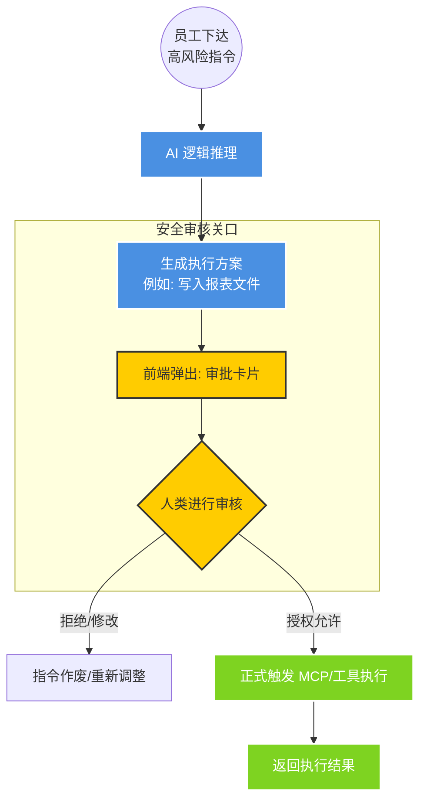

# 第五章：安全总闸 —— 人机协同审核体系 (Human-in-the-loop)

### 1. 核心定位：决策权永远在人手中

**人机协同**模块是系统的“最后一道防线”。它改变了 AI 的执行模式：

- **普通 AI**：接到指令直接执行（如删除文件、修改数据），一旦 AI 报错，损失无法挽回。
- **AICopilot**：将高风险操作定义为**“待审核任务”**。AI 只能准备好方案，必须由人类点击“允许”，动作才会真正下达。

------

### 2. 运行流程图：带“审批关卡”的执行链路

代码段

------

### 3. 技术实现亮点：如何实现“受控自动化”？

我们通过前端与后端的深度联动，确保了审核流程的严密性：

- **可视化审批卡片 (Visual Approval Card)**：

  系统不再返回冷冰冰的代码，而是通过 `ApprovalCard.vue` 组件将 AI 的意图转化为**可视化表单**。

  - *例如*：如果 AI 准备写入一个文件，卡片会清晰显示：“文件名”、“写入路径”、“具体内容”。

- **高风险动作挂起 (Action Suspension)**：

  在 `FinalAgentRunExecutor` 驱动的工作流中，任何涉及文件修改或系统变动的工具调用都会进入“挂起”状态。

  - **核心逻辑**：系统在等待前端的 `allow`（允许）信号。没有这个明确的数字签名，后端代码层级会物理阻断执行指令。

- **操作可追溯 (Traceability)**：

  每一次“人类点击允许”的操作都会被记录在会话历史中。

  - **业务意义**：谁在什么时候授权 AI 做了什么事，全程有据可查，符合企业审计要求。

------

### 4. 这一模块对公司的业务价值

1. **责任闭环**：AI 是助手，人是责任人。通过人工确认，将 AI 的技术优势与人的管理经验完美结合。
2. **容错率极高**：AI 可能会在生成复杂报表时出现细节偏差，人类通过审批卡片可以提前预览结果，发现问题一键“拦截”，避免错误下发。
3. **合规与安全**：满足金融、制造等行业对于“关键业务必须有人介入”的合规性要求，让 AI 真正敢于在生产环境中使用。

