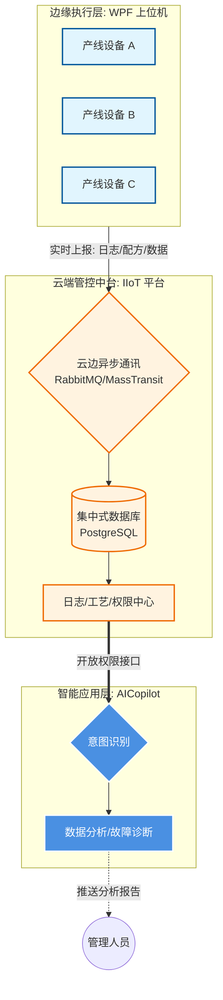

# 第六章：数据基座 —— 云边协同 IIoT 工业互联网平台

### 1. 核心定位：AI 大脑的“感官”与“记忆”

**新一代产线云边协同系统**是整个工厂数字化的底座。它负责连接分布在车间各处的上位机（边缘端），将碎片化的生产现场转化为结构化的数字资产。

对于 AI 项目（AICopilot）而言，这个平台的作用不可替代：

- **它是数据的“供货商”**：为 AI 提供最真实的日志、工艺配方和生产记录。
- **它是指令的“传送带”**：AI 经过分析得出的建议，可以通过此平台精准下发到具体的设备端。

------

### 2. 系统协作架构图 (数据流向视角)

这个图展示了数据如何从**机台**流向**云端**，最终喂给 **AI** 进行分析：

代码段

------

### 3. 三大业务核心职能（当前价值）

- **工艺参数全生命周期管理**：

  实现配方的“一云多端”统一管理。AI 可以检索历史最优工艺参数，对比当前机台设置，发现潜在的生产风险。

- **设备身份与安全鉴权 (MAC 地址识别)**：

  系统通过识别物理网卡（MAC）和人员权限，确保只有授权的人和设备能操作关键流程。这些权限数据同步给 AI，保证了 AI 操作的合规性。

- **全局日志异步汇聚**：

  通过高性能的消息队列（RabbitMQ），将全厂几十台上位机的日志实时汇总。这意味着管理员不需要去现场翻 U 盘，在办公室就能通过 AI 查遍全厂历史。

------

### 4. 承上启下：为 AI 带来的无限可能

这个平台的接入，让 AI 具备了**“上帝视角”**：

1. **日志溯源分析**：AI 可以自动检索某台设备过去 24 小时的日志，分析报错频率，判断是硬件老化还是操作不当。
2. **实时健康监测**：后续接入实时数据后，AI 可以分析 8:00 到 12:00 的运行曲线，识别出细微的异常波动，实现**“预测性维护”**。

