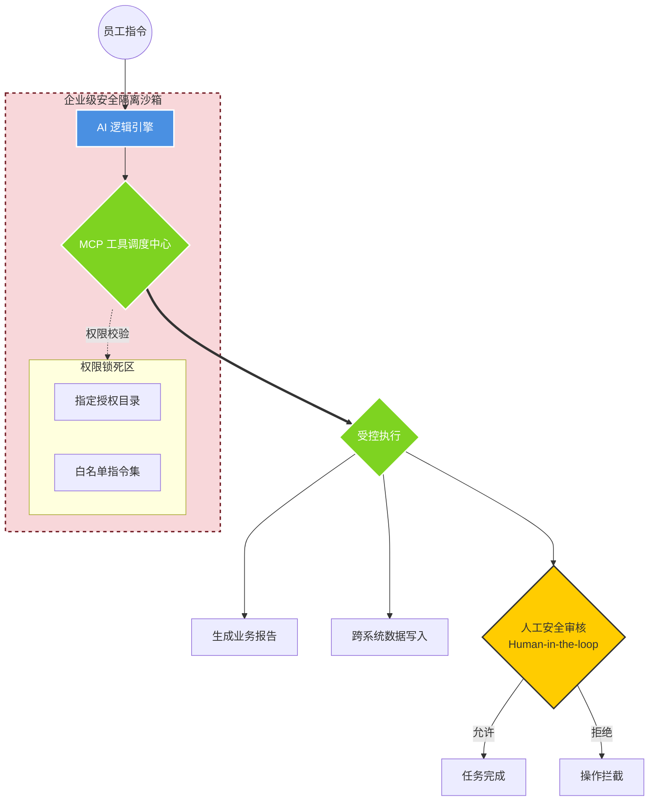

# 第四章：自动化执行专家 —— MCP 跨平台工具与安全受控体系

### 1. 核心定位：AI 的“标准化执行手臂”

如果说 Text-to-SQL 是让 AI “会算账”，那么 **MCP (Model Context Protocol)** 就是让 AI “会干活”。它是目前国际最前沿的 AI 协议，支持 AI 跨系统读取文件、编写代码、操作业务软件。

------

### 2. 安全架构图：基于“隔离沙箱”的权限控制

我们将本系统与市面上普通 AI（如 Cursor 或开源助手）的“全开放访问”进行了本质区别：

代码段

------

### 3. 企业级应用的核心优势：为什么我们更安全？

在源码实现中，我们通过 `McpServerInfo` 和 `McpServerManager` 构建了极其严苛的防线：

- **唯一路径授权（Directory Pinning）**：
  - **区别于普通 AI**：普通 AI 通常拥有对电脑或服务器的全局访问权限，极易泄露隐私。
  - **我们的优势**：系统被锁死在**“指定的授权目录”**内。AI 只能在您划定的“一亩三分地”里读写文件。如果 AI 尝试访问其他目录（如系统核心配置或隐私文档），底层的 MCP 协议会直接切断连接。
  - **业务意义**：这意味着您可以放心地让 AI 在“财务报表区”生成报表，而不用担心它窥探“技术机密区”。
- **“白名单”工具管控 (Tool Whitelisting)**：
  - 每一项工具（如文件写入、系统重启等）都必须在 `McpServerConfiguration` 中显式注册。未授权的工具，AI 即使识别到了意图也无法调用。
- **人工安全审核机制 (Human-in-the-loop)**：
  - 对于文件删除、大额转账指令或核心数据修改，系统前端会触发一个**“审批卡片”**。
  - **核心逻辑**：AI 提出方案 $\rightarrow$ 弹出审核窗口 $\rightarrow$ **人点击确认** $\rightarrow$ 执行操作。这种设计确保了“决策权始终在人手中”。

------

### 4. 这一模块对公司的业务价值

1. **自动化闭环**：不仅能生成分析结果，还能自动把结果写成 Word 或 Excel 存入指定文件夹，真正解放双手。
2. **安全生产保障**：通过目录锁死技术，确保 AI 所有的自动化操作都在合规边界内，不会对企业 IT 环境造成破坏。
3. **标准化扩展**：基于 MCP 标准，未来公司新开发的任何业务系统，都能通过该协议“即插即用”地接入 AI 助理。